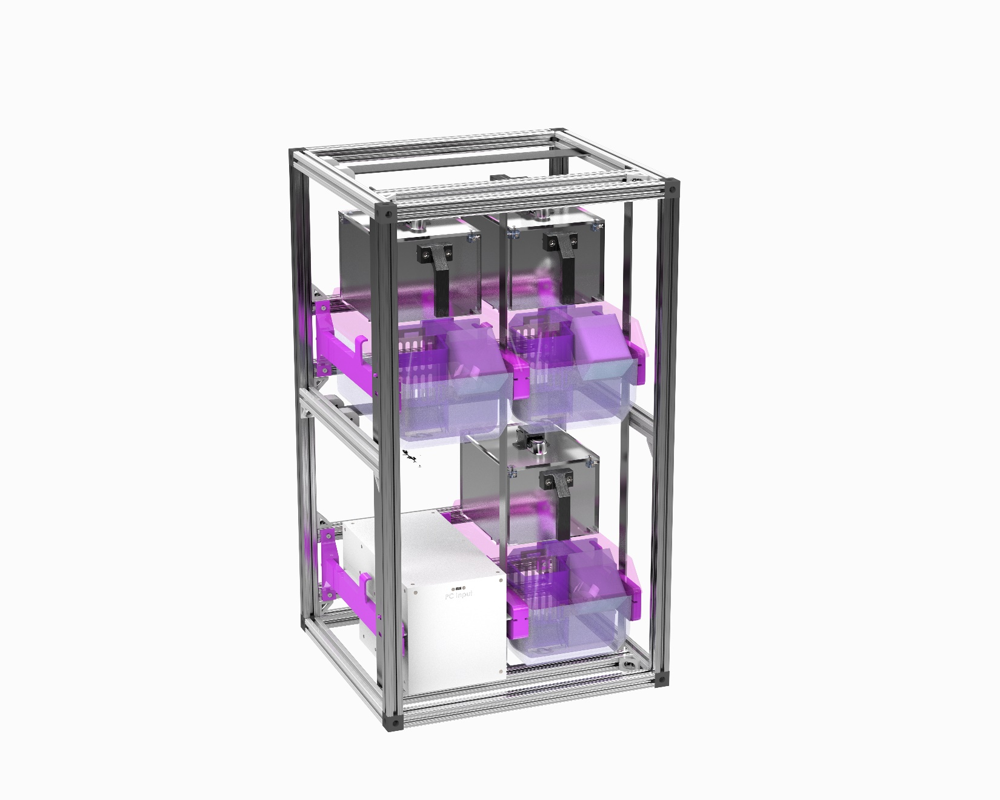{width="4.468751093613299in"
height="6.0in"}

# Table of Contents {#table-of-contents .TOC-Heading}

[MouseVUER System Overview
[4](#mousevuer-system-overview)](#mousevuer-system-overview)

[The Monitoring Cage Assembly
[4](#the-monitoring-cage-assembly)](#the-monitoring-cage-assembly)

[The Monitoring Cage Overview
[4](#the-monitoring-cage-overview)](#the-monitoring-cage-overview)

[Monitoring Cage Unit Fabrication
[5](#monitoring-cage-unit-fabrication)](#monitoring-cage-unit-fabrication)

[Modified Lid Fabrication
[5](#modified-lid-fabrication)](#modified-lid-fabrication)

[Hopper Fabrication [5](#hopper-fabrication)](#hopper-fabrication)

[Igloo Fabrication [5](#igloo-fabrication)](#igloo-fabrication)

[Monitoring Cage Assembly
[6](#monitoring-cage-assembly)](#monitoring-cage-assembly)

[Hopper Assembly [7](#hopper-assembly)](#hopper-assembly)

[Igloo Assembly [8](#igloo-assembly)](#igloo-assembly)

[Finished Monitoring Cage Unit Assembly
[10](#finished-monitoring-cage-unit-assembly)](#finished-monitoring-cage-unit-assembly)

[The Power and Control Module (PCM) Assembly
[12](#the-power-and-control-module-pcm-assembly)](#the-power-and-control-module-pcm-assembly)

[PCM Overview [12](#pcm-overview)](#pcm-overview)

[System Fabrication [12](#system-fabrication)](#system-fabrication)

[Enclosure Fabrication
[13](#enclosure-fabrication)](#enclosure-fabrication)

[The PCM Assembly [13](#the-pcm-assembly)](#the-pcm-assembly)

[Side and Top Panel Assemblies
[16](#side-and-top-panel-assemblies)](#side-and-top-panel-assemblies)

[Electronic Subassemblies
[17](#electronic-subassemblies)](#electronic-subassemblies)

[Main Body Assembly [19](#main-body-assembly)](#main-body-assembly)

[Modular Rack Assembly
[23](#modular-rack-assembly)](#modular-rack-assembly)

[Modular Rack Overview
[23](#modular-rack-overview)](#modular-rack-overview)

[Modular Rack Fabrication
[23](#modular-rack-fabrication)](#modular-rack-fabrication)

[Modular Rack Assembly
[23](#modular-rack-assembly-1)](#modular-rack-assembly-1)

[Appendix -- Step by Step Instructions
[35](#appendix-step-by-step-instructions)](#appendix-step-by-step-instructions)

[Monitoring Cage Assembly
[35](#monitoring-cage-assembly-1)](#monitoring-cage-assembly-1)

[Hopper Assembly [35](#hopper-assembly-1)](#hopper-assembly-1)

[Igloo Assembly [37](#igloo-assembly-1)](#igloo-assembly-1)

[Monitoring Cage Unit Assembly
[42](#monitoring-cage-unit-assembly)](#monitoring-cage-unit-assembly)

[Power and Control Module (PCM)
[44](#power-and-control-module-pcm)](#power-and-control-module-pcm)

[Side Panel Subassembly [44](#_Toc147213275)](#_Toc147213275)

[Top Panel Subassembly
[48](#top-panel-subassembly)](#top-panel-subassembly)

[Power Supply Subassembly
[49](#power-supply-subassembly)](#power-supply-subassembly)

[Power Distribution Board Subassembly
[50](#power-distribution-board-subassembly)](#power-distribution-board-subassembly)

[SBC Subassembly [51](#sbc-subassembly)](#sbc-subassembly)

[PCM Main Body Assembly
[53](#pcm-main-body-assembly)](#pcm-main-body-assembly)

[Modular Rack Assembly
[65](#modular-rack-assembly-2)](#modular-rack-assembly-2)

[Rack Top Subassembly
[65](#rack-top-subassembly-1)](#rack-top-subassembly-1)

[Rack Base Subassembly
[70](#rack-base-subassembly-1)](#rack-base-subassembly-1)

[Rack Mid Bar Subassembly
[74](#rack-mid-bar-subassembly-1)](#rack-mid-bar-subassembly-1)

[Rack Rear Bar Subassembly
[76](#rack-rear-bar-subassembly-1)](#rack-rear-bar-subassembly-1)

[Rack Assembly [78](#rack-assembly-1)](#rack-assembly-1)

# 

# MouseVUER System Overview

The Mouse Video Utility for Experiments Recording (MouseVUER) is an
open-source system for housing and monitoring rodents for experiments.
The MouseVUER system fits inside a custom modular rack that houses all
the components for running the system. The monitoring cage units are
where the rodents are monitored. There are three monitoring cage units
per MouseVUER system. Each monitoring unit has subassemblies including
an Igloo and Hopper that must be assembled. The Igloo supports the
camera and LEDs above the mouse lid. The hopper is specially designed to
fit into the mouse cages and supply food and water. One Power and
Control Module (PCM) will need to be fabricated for every MouseVUER
system. The PCM is responsible for powering and housing electronics to
run the MouseVUER system. Figure 1 shows the components of the MouseVUER
system.

{width="5.0in" height="4.0in"}

Figure 1 Fully assembled MouseVUER system.

This document is organized into subassemblies to build the final
MouseVUER system. Each subassembly has a fabrication and assembly
section. Each subassembly has a bill of materials for one subassembly
unit. In the appendix, larger figures of all assembly steps are shown.

# The Monitoring Cage Assembly

## The Monitoring Cage Overview

The Monitoring Cage units are where the rodents are monitored. These
instructions are for one Monitoring Cage unit and must be repeated two
more times for each MouseVUER system. The Monitoring Cage unit has
subassemblies called the Igloo and Hopper that must be assembled before
assembling the final Monitoring Cage unit.

{width="5.865580708661417in"
height="4.0in"}

Figure 2 The final Monitoring Cage unit Assembly

## Monitoring Cage Unit Fabrication

### Modified Lid Fabrication

A solid clear NexGen lid (P/N: 228790-1, Allentown Inc, Allentown, NJ)
will need to be modified to support the Monitoring Cage unit. A DXF file
can be found on the Github page, and it will need to cut into the lid.
In this fabrication process, a waterjet was used to make the cuts into
the lid. In this process, a single pass of the waterjet was used even
for the varying heights of the lid.

### Hopper Fabrication

The two-compartment hopper was designed to house food pellets and a
water bottle inside the NexGen standard cage (P/N: 223581-4, Allentown
Inc, Allentown, NJ). The hopper must be injection molded (ICOMold Inc.,
Hartland, WI) from a food safe, autoclavable material (PSU Ultrason
S3010, BASF, Ludwigshafen, Germany). The food grate (304SS, 26-gauge,
Yarde Metal, White Marsh, MD) is fabricated with a waterjet and bending
tool. The bottle holder (304SS, 24-gauge, Yarde Metal, White Marsh, MD)
is fabricated with a waterjet.

### Igloo Fabrication

The igloo consists of five clear acrylic panels fixed together to
support a camera above the mouse cage. The acrylic panels (Clear Cast
Acrylic-1/4", Piedmont Plastics, Elkridge, Maryland) must be cut. In
this fabrication process a CO~2~ laser cutter (PLS6.150D, Universal
Laser Systems) was used for cutting the panels. Holes on the panels will
need to be countersink with a 90° Countersink drill bit. Two holes on
the top panel will need to be tapped for 4-40 threads. The handle and
camera bracket will need to be 3D printed. In this fabrication process,
the Markforged X7 (Waltham, MA) was used to print the parts out of Onyx.

## Monitoring Cage Assembly

The bill of materials for the assembly of one Monitoring Cage unit is
shown in Table 1. The mouse cage lid must be modified before assembling
the Monitiroing Cage unit. Items that were custom made have .STP or .DXF
or .STL files to reference on the Github page. All other items were
purchased from vendors.

<table>
<caption>
Bill of materials for the assembly of one SAHM
unit.
</caption>
<colgroup>
<col style="width: 7%" />
<col style="width: 15%" />
<col style="width: 22%" />
<col style="width: 14%" />
<col style="width: 17%" />
<col style="width: 8%" />
<col style="width: 14%" />
</colgroup>
<tbody>
<tr class="odd">
<td>ITEM NO.</td>
<td>Part Label</td>
<td>Description</td>
<td>Source</td>
<td>Vendor Part Number</td>
<td>Qty</td>
<td>Cost</td>
</tr>
<tr class="even">
<td>1</td>
<td>Mouse Cage Base</td>
<td>MOUSE, XJ/NEXGEN, CLEAR POLYSULFONE HIGH TEMPERATURE PLASTIC, WHITE
AIR KUP</td>
<td>Allentown Inc.</td>
<td>223581-4</td>
<td>1</td>
<td>$48.60</td>
</tr>
<tr class="odd">
<td>2</td>
<td>Mouse Cage Lid</td>
<td>MICRO BARRIER TOP, MOUSE, NEXGEN, SOLID, CLEAR POLYSULFONE HIGH
TEMPERATURE PLASTIC, NO LOCKS</td>
<td>Allentown Inc.</td>
<td>228790-1</td>
<td>1</td>
<td>$139.50</td>
</tr>
<tr class="even">
<td>3</td>
<td>Water bottle</td>
<td> Bottle Udel 9 oz., Ink with "O" Ring</td>
<td>Thoren Caging Systems, Inc.</td>
<td>BW09UIRNO</td>
<td>1</td>
<td>$7.11</td>
</tr>
<tr class="odd">
<td>4</td>
<td>Sipper Tube</td>
<td>Stainless steel with 2 1/2" welded bent sipper tube</td>
<td>Thoren Caging Systems, Inc.</td>
<td>BWCS250HSB</td>
<td>1</td>
<td>$3.79</td>
</tr>
<tr class="even">
<td>5</td>
<td>Hopper</td>
<td>PSU Ultrason S3010</td>
<td>Injection Molded</td>
<td>N/A - refer to STP file</td>
<td>1</td>
<td>$92.19</td>
</tr>
<tr class="odd">
<td>6</td>
<td>Stainless Steel Grommet</td>
<td>Stainless Steel Fabric Grommets with Washer</td>
<td>McMaster-Carr</td>
<td>96015K33</td>
<td>1</td>
<td>$16.68</td>
</tr>
<tr class="even">
<td>7</td>
<td>Food Grate</td>
<td>304SS, 26 Gauge stock piece</td>
<td>Waterjet Cut</td>
<td>N/A - refer to DXF file</td>
<td>1</td>
<td></td>
</tr>
<tr class="odd">
<td>8</td>
<td>Bottle Holder</td>
<td>304SS, 24 Gauge stock piece</td>
<td>Waterjet Cut</td>
<td>N/A - refer to DXF file</td>
<td>1</td>
<td></td>
</tr>
<tr class="even">
<td>9</td>
<td>4-40, 3/8" Flat</td>
<td>Passivated 18-8 Stainless Steel Phillips Flat Head Screw</td>
<td>McMaster-Carr</td>
<td>91099A165</td>
<td>2</td>
<td>$5.55</td>
</tr>
<tr class="odd">
<td>10</td>
<td>Camera</td>
<td>Depth Camera D435</td>
<td>Intel Inc.</td>
<td>D435</td>
<td>1</td>
<td>$314.00</td>
</tr>
<tr class="even">
<td>11</td>
<td>Camera Bracket</td>
<td>3D Printed FDM</td>
<td>3D printed</td>
<td>N/A - refer to STL file</td>
<td>1</td>
<td>$3.00</td>
</tr>
<tr class="odd">
<td>12</td>
<td>1/4"-20, 3/8" Flat</td>
<td>Passivated 18-8 Stainless Steel Phillips Flat Head Screw</td>
<td>McMaster-Carr</td>
<td>91771A535</td>
<td>1</td>
<td>$12.13</td>
</tr>
<tr class="even">
<td>13</td>
<td>1/4"-20 Nut</td>
<td>18-8 Stainless Steel Thin Hex Nut</td>
<td>McMaster-Carr</td>
<td>91847A029</td>
<td>2</td>
<td>$6.36</td>
</tr>
<tr class="odd">
<td>14</td>
<td>1/4"-20, 7/8" Flat</td>
<td>Passivated 18-8 Stainless Steel Phillips Flat Head Screw</td>
<td>McMaster-Carr</td>
<td>91099A478</td>
<td>2</td>
<td>$12.99</td>
</tr>
<tr class="even">
<td>15</td>
<td>Handle</td>
<td>3D Printed FDM</td>
<td>3D printed</td>
<td>N/A - refer to STL file</td>
<td>1</td>
<td>$10.00</td>
</tr>
<tr class="odd">
<td>16</td>
<td>M3, 10mm Flat</td>
<td>316 Stainless Steel Phillips Flat Head Screw</td>
<td>McMaster-Carr</td>
<td>91801A156</td>
<td>12</td>
<td>$9.91</td>
</tr>
<tr class="even">
<td>17</td>
<td>Igloo Front Panel</td>
<td>Cut from 12"x24"x1/4" Clear Cast Acrylic</td>
<td>Laser Cut</td>
<td>N/A - refer to DXF file</td>
<td>1</td>
<td>$13.00</td>
</tr>
<tr class="odd">
<td>18</td>
<td>Igloo Side Panel</td>
<td>Cut from 12"x24"x1/4" Clear Cast Acrylic</td>
<td>Laser Cut</td>
<td>N/A - refer to DXF file</td>
<td>2</td>
<td>$13.00</td>
</tr>
<tr class="even">
<td>19</td>
<td>Igloo Top Panel</td>
<td>Cut from 12"x24"x1/4" Clear Cast Acrylic</td>
<td>Laser Cut</td>
<td>N/A - refer to DXF file</td>
<td>1</td>
<td>$13.00</td>
</tr>
<tr class="odd">
<td>20</td>
<td>Cube Standoff</td>
<td>Aluminum M3 Modding Cubes</td>
<td>V1 Tech</td>
<td>N/A</td>
<td>4</td>
<td>$5.00</td>
</tr>
<tr class="even">
<td colspan="6">Total Cost Per SAHM Unit</td>
<td>$725.81</td>
</tr>
</tbody>
</table>

### Hopper Assembly 

The hopper subassembly should be completed before inserting into the
Monitoring Cage unit. The first step involves using a hammer-driven
punch (9612K28, McMaster-Carr, Elmhurst, IL) to lock the stainless steel
grommet in place. The food grate is then inserted and locked in by two
tabs. Lastly, the bottle holder is inserted and locked in via tabs. The
hopper assembly instructions are shown in Figure 3.

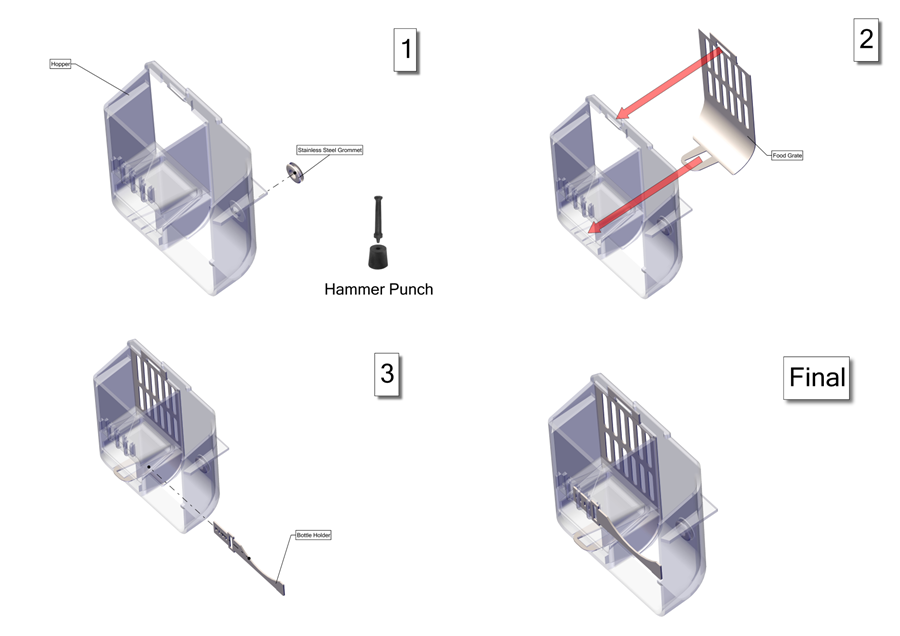{width="6.000694444444444in"
height="4.240277777777778in"}

Figure 3 The Hopper sub assembly.

### Igloo Assembly 

The igloo subassembly must be completed before inserting into the
Monitoring Cage unit. A Phillips no. 2 screwdriver will be required for
fastening all screws in this section. The first four steps in the igloo
assembly are shown in Figure 4. Four cube standoffs will be fastened to
the top panel with four M3, 10mm flat screws. The rear panel will be
secured via two M3, 10mm flat screws. Next, the 2 side panels will be
secured by two M3, 10mm flat screws for each panel.

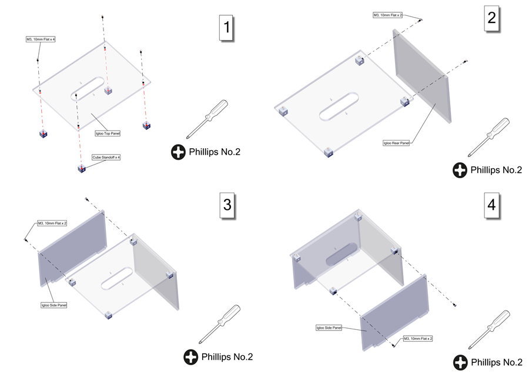{width="5.660661636045495in"
height="4.0in"}

Figure 4 Steps 1 to 4 of the Igloo subassembly.

The next step is to fasten the front panel with two M3, 10mm flat
screws. The handle will be secured in place via two ¼"-20, 7/8" flat
screws and two ¼"-20 nuts. The camera is bolted to the camera bracket by
a ¼"-20, 3/8" flat screw. Two 4-40, 3/8" screws are used to fasten the
camera bracket to the igloo. These steps are shown in Figure 5. The
final igloo subassembly is shown in Figure 6.

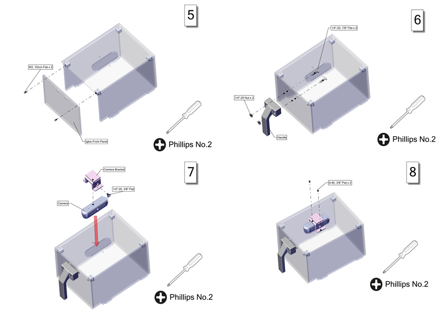{width="5.660661636045495in"
height="4.0in"}

Figure 5 Steps 5 to 8 for the Igloo subassembly.

{width="4.24297353455818in"
height="3.0in"}

Figure 6 The final Igloo subassembly.

### Finished Monitoring Cage Unit Assembly 

Once the hopper and igloo assemblies are completed, the Monitoring Cage
unit can be constructed. Four steps are required in this process, and
they are shown in Figure 7. The first step is to insert the hopper near
the front of the mouse cage base. Next, the water bottle is inserted
into the hopper. The third step involves securing the hopper in place
via a tab on the mouse cage lid. The blue arrow in step 3 shows the
locking tab. The last step is to insert the igloo to the mouse cage lid
by aligning the four cutouts shown via 4 red arrows. The final
Monitoring Cage assembly is shown in Figure 8.

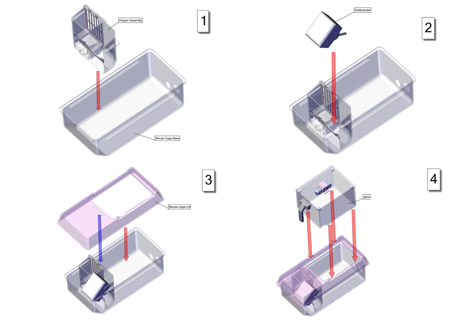{width="5.660661636045495in"
height="4.0in"}

Figure 7 The steps to complete the Monitoring Cage assembly.

{width="4.24297353455818in"
height="3.0in"}

Figure 8 The final Monitoring Cage assembly.

# The Power and Control Module (PCM) Assembly

## PCM Overview

The PCM is responsible for powering, controlling, and data communication
with three Monitoring Cage units to successfully monitor the rodents.
The PCM is designed to slide into one of the open slots on the custom
racks using 3D printed rails. The PCM will have electronic connections
in the rear to the three Monitoring Cage units. Each PCM has three
single board computers (SBC) (70878-AI-TX2, Auvidea Denklingen, Germany)
utilized as compression units compressing data from one of the
Monitoring Cage units and sends the data via ethernet to the network
switch (EH2306, ATOP Technologies, Zhubei City, Taiwan) inside the PCM.
The switch relays the data to an ethernet panel mount (MRJ-5780-01,
Amphenol ICC, Wallingford, CT) on the PCM that can be sent to an
external storage system for the user. The PCM has a power supply
(MPB125-4350G, Bel Power Solutions, New Jersey City, NJ) that connects
to a power entry module (KM01.1105.11, Schurter Inc., Santa Rosa, CA)
which can be powered to a standard AC 110V wall outlet. The power supply
is connected to a custom power distribution board responsible for
powering the internal components of the PCM. The internal components
powered by the power distribution board include the three SBC
compression units, the ethernet switch, a fan (MF40100V1-1000U-A99,
Sunon Fans, Brea, CA) and a microcontroller (2590, Adafruit Industries
LLC, New York, NY). The fan helps with thermal management by providing
airflow through the PCM to prevent overheating of the internal
components. The microcontroller allows for controlling auxiliary power
options. The PCM has multiple connections in the rear as shown in figure
2. Two connections are for the power module and ethernet port. Three
connections are for individual data communication between the PCM and
each Monitoring Cage unit. Three 6 pin connectors are available for
auxiliary power for future abilities such as controlling LED lighting on
each of the Monitoring Cage units.

{width="4.442297681539808in"
height="3.1333333333333333in"}

Figure 9 The PCM backside with electrical connections and fan.

## System Fabrication 

The PCM was designed using 3D computer-aided design (CAD) software
SolidWorks 2022 (Dassault Systems SolidWorks Corporation, Concord, NH).
ABS material components were printed using a FDM printer (F370,
Stratasys, Rehovot, Israel). Cast acrylic components were cut from bulk
material using a CO~2~ laser cutter (PLS6.150D, Universal Laser Systems,
Scottsdale, AZ).

## Enclosure Fabrication

The enclosure consists of four parts: the main body, rail, top panel,
and right panel. The top and right panels were fabricated by cutting
them out of 12"x24"x1/8" cast acrylic using a laser cutter. Afterwards
countersinks were drilled into the holes using a 90° Countersink drill
bit. The main body and rail were 3D printed using a FDM 3D printer and
GrabCAD Print software from Stratasys. The print orientation for the
parts at 0.0130-inch slice height is shown in figure 10.

{width="2.632782152230971in"
height="2.352742782152231in"}

Figure 10 Main body and rail orientation for 3D printing in GrabCAD
Print.

## The PCM Assembly

The bill of materials for the assembly of the PCM is shown in Table 2.
The main body, rail, top panel, and side panel must be fabricated as
previously mentioned. The power distribution board must also be
fabricated. In this design, the power distribution board was designed in
Altium Designer (Altium, San Diego, CA) and fabricated using a circuit
board plotter (LPKF S104, LPKF Laser & Electronics, Garbsen, Germany).
Items that were custom made have .DXF or .STL files to reference on the
Github page. The other items were purchased from vendors.

Table 2 Bill of materials for the PCM assembly.

  -------------------------------------------------------------------------------------------------------------
  ITEM    Part Label     Description                   Source          Vendor Part Number    Qty   Cost
  NO.                                                                                              
  ------- -------------- ----------------------------- --------------- --------------------- ----- ------------
  1       Main Body      3D Printed FDM                N/A             N/A -- refer to STL   1     \$150.00
                                                                       file                        

  9       Rail           3D Printed FDM                N/A             N/A -- refer to STL   1     \$3.00
                                                                       file                        

  10      Top Panel      Cut from 12\"x24\"x1/8\" Cast Laser Cut       N/A -- refer to DXF   1     \$13.00
                         Acrylic                                       file                        

  11      Side Panel     Cut from 12\"x24\"x1/8\" Cast Laser Cut       N/A -- refer to DXF   1     \$13.00
                         Acrylic                                       file                        

  12      Power          LPKF Fabrication              N/A             N/A -- refer to zip   1     \$125.00
          Distribution                                                 file                        
          Board                                                                                    

  14      SBC Unit       JN30D for NVIDIA® Jetson      Auvidea         70878-AI-TX2          3     \$825.00
                         Nano™ and TX2 NX™                                                         

  17      Power Supply   Open Frame AC DC Converters 4 Bel Power       MPB125-4350G          1     \$169.00
                         Output 3.3V 5V 12V -12V 90 \~ Solutions                                   
                         264 VAC Input                                                             

  18      Switch         Network Switch-Unmanaged 6    ATOP            EH2306                1     \$113.00
                         Port                          Technologies                                

  19      Power Mount    PWR Entry Connector           Schurter Inc.   KM01.1105.11          1     \$15.95
                         Receptacle, Male Blades -                                                 
                         Module IEC 320-C14 Panel                                                  
                         Mount, Snap-In                                                            

  20      Ethernet Mount CONN MOD Coupler 8P8C to 8P8C Amphenol ICC    MRJ-5780-01           1     \$21.84
                                                       (Commercial                                 
                                                       Products)                                   

  21      USB Mount      CBL USB2.0 MCMR RCPT-MCR B    Adafruit        3258                  1     \$4.95
                         Plug                          Industries LLC                              

  23      Fan            Fan Axial 40x10mm VAPO 5VDC   Sunon Fans      MF40100V1-1000U-A99   1     \$4.81
                         Wire                                                                      

  24      Fan Cover      Fan Guard 40mm Metal          Sunon Fans      FG-4                  1     \$1.42

  25      Cube Standoff  Aluminum M3 Modding Cubes     V1 Tech         N/A                   10    \$15.00

  26      M3, 8mm Pan    Passivated 18-8 Stainless     McMaster-Carr   92000A118             3     \$5.51
                         Steel\                                                                    
                         Pan Head Phillips Screws                                                  

  27      M3, 8mm Flat   Passivated 18-8 Stainless     McMaster-Carr   92010A118             19    \$5.52
                         Steel\                                                                    
                         Phillips Flat Head Screw                                                  

  28      M3, 5mm Pan    Passivated 18-8 Stainless     McMaster-Carr   92000A114             8     \$5.45
                         Steel\                                                                    
                         Pan Head Phillips Screws                                                  

  29      M3, 8mm        Female Threaded Hex Standoff  McMaster-Carr   94868A164             8     \$10.08
          Standoff F/F                                                                             

  30      M3, 35mm       Male-Female Threaded Hex\     McMaster-Carr   93655A224             8     \$39.44
          Standoff M/F   Standoff                                                                  

  31      M3, 6mm        Male-Female Threaded Hex\     McMaster-Carr   93655A093             4     \$15.64
          Standoff M/F   Standoff                                                                  

  32      M3 Nut         18-8 Stainless Steel Hex Nut  McMaster-Carr   91828A211             4     \$4.73

  33      M3, 10mm Flat  Passivated 18-8 Stainless     McMaster-Carr   92010A120             12    \$5.91
                         Steel\                                                                    
                         Phillips Flat Head Screw                                                  

  34      M3, 12mm Flat  Passivated 18-8 Stainless     McMaster-Carr   92010A122             4     \$6.04
                         Steel\                                                                    
                         Phillips Flat Head Screw                                                  

  35      M3, 30mm Flat  Passivated 18-8 Stainless     McMaster-Carr   92010A138             4     \$10.26
                         Steel\                                                                    
                         Phillips Flat Head Screw                                                  

  36      M4, 18mm Pan   Passivated 18-8 Stainless     McMaster-Carr   92000A227             4     \$12.95
                         Steel\                                                                    
                         Pan Head Phillips Screws                                                  

  45      M4 Nut         18-8 Stainless Steel Hex Nut  McMaster-Carr   91828A231             4     \$6.59

  46      4-40, 1/2\"    Passivated 18-8 Stainless     McMaster-Carr   91771A110             2     \$6.63
          Flat           Steel\                                                                    
                         Phillips Flat Head Screw                                                  

  47      M12 Connector  Micro M12 Screw-Together\     McMaster-Carr   4458N11               3     \$58.95
                         Connector                                                                 

  48      Locknut        1/2 NPT Black Locknut         McMaster-Carr   3185K112              3     \$2.61
                         for Continuous-Flex Plastic                                               
                         Conduit Fitting                                                           

  49      USB A to C     USB AM TO USB C, USB 2.0 -    Cvilux USA      DH-20M50054           3     \$3.87
                         150MM                                                                     

  50      Ethernet Cable Cable Mod 8P8C Plug to Plug   Amphenol Cables MP-64RJ45UNNY-001     1     \$3.81
          1ft            1ft                           on Demand                                   

  51      Ethernet Cable Ethernet Cables / Networking  Amphenol Cables MP-64RJ45UNNB-002     3     \$13.35
          2ft            Cables CAT 6 UNSHIELDED,      on Demand                                   
                         BLUE, 2ft                                                                 

  52      Power Fuse     Fuse Drawer For PWR MOD       Schurter Inc.   4301.1403             1     \$5.61
                         X-SAFE 2PL                                                                

  53      3 Pin Plug     Term Block Plug 3POS STR      Weidmuller      1943820000            2     \$7.36
                         5.08mm                                                                    

  54      14 Pin Plug    Conn RCPT HSG 14POS 3.96mm    Molex           9508143               2     \$24.36

  55      2 Pin Plug     CONN RCPT HSG 3POS 3.96MM     Molex           9508033               1     \$0.26

  56      Pins           CONN 18-20AWG CRIMP TIN       Molex           0008520113            31    \$8.00

  57      20 Gauge Wire  N/A                           N/A             N/A                   5ft   \$0.00

  58      Velcro or Zip  Optional                      N/A             N/A                   N/A   \$0.00
          Ties                                                                                     

  Total                                                                                            \$1,737.90
  Cost                                                                                             
  Per PCM                                                                                          
  -------------------------------------------------------------------------------------------------------------

### Side and Top Panel Assemblies

To allow for assembly of the internal components of the PCM, there needs
to be access from the user to get inside the enclosure. The user can do
this by removing the side and top panels of the PCM. Each panel will
have its own subassembly to allow for easy removal and installation of
each panel. The side panel requires the 3D printed rail, three M3, 8mm
pan screws, three cube standoffs, and three M3, 8mm flat screws. The
instructions for the side panel assembly are shown in Figure 11.

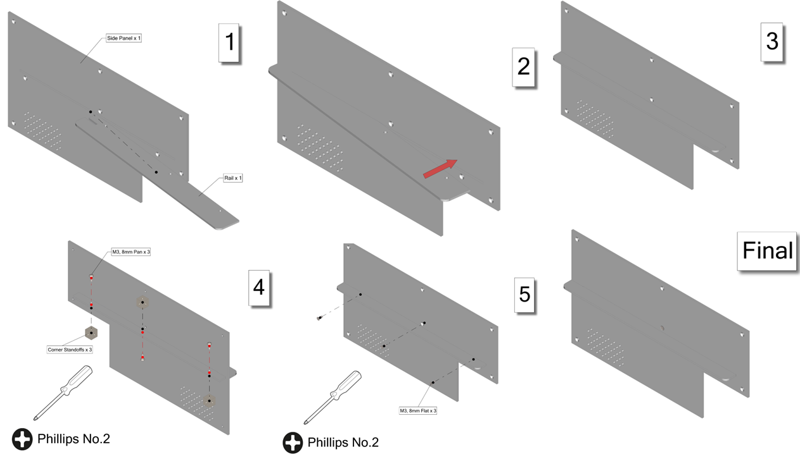{width="6.245833333333334in"
height="3.5900918635170602in"}

Figure 11 The side panel subassembly.

The top panel requires five M3, 8mm flat screws and five cube standoffs.
The top panel assembly is shown in Figure 12.

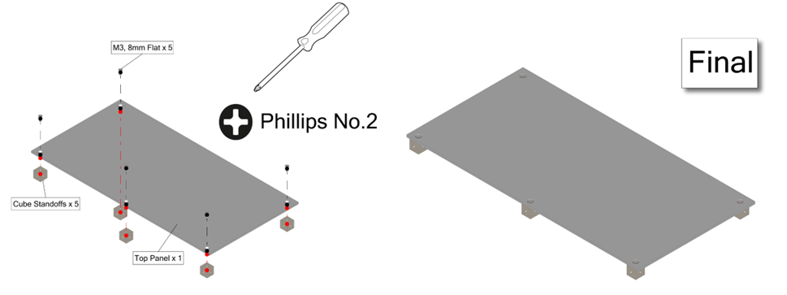{width="5.583333333333333in"
height="2.0915748031496064in"}

Figure 12 The top panel subassembly.

### Electronic Subassemblies

The electronic subassemblies should be assembled before inserting into
the enclosure. The subassemblies will be for the power supply, power
distribution board, and the SBC units. The power supply and power
distribution board assembly each require four M3, 8mm pan screws and
four M3, 8mm standoffs female/female. The power supply and the power
distribution board instructions are shown in Figures 13 and 14.

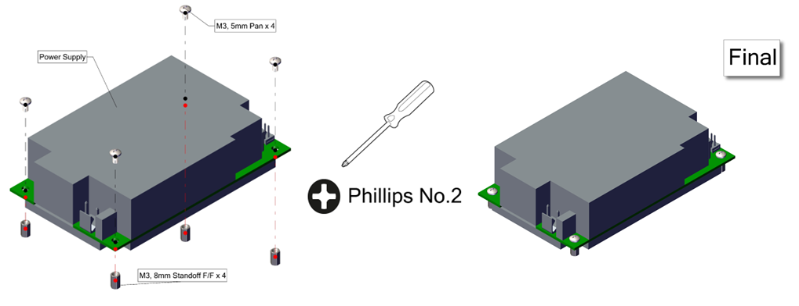{width="6.79375in"
height="2.613888888888889in"}

Figure 13 The power supply subassembly.

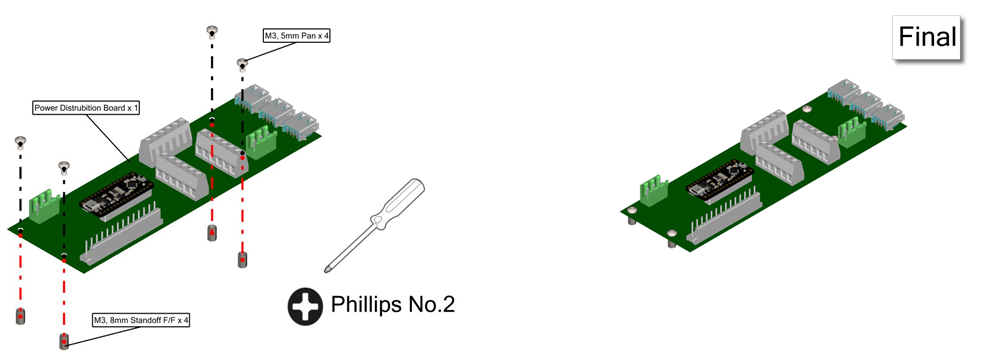{width="6.0in"
height="2.138464566929134in"}

Figure 14 The power distribution board subassembly.

To consolidate space, the three SBC compression units are stacked on one
another using standoffs. To do this, an SBC subassembly must be made.
The subassembly requires eight M3, 35mm standoffs male/female, four M3,
6mm standoffs male/female, and four M3 nuts. All parts can be hand
tightened. The instructions for the SBC subassembly are shown in Figure
15.

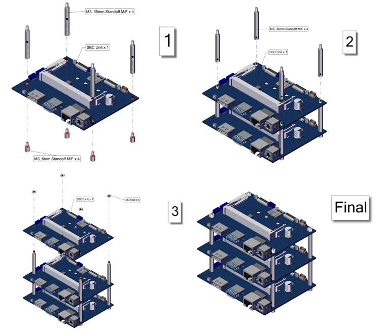{width="5.073611111111111in"
height="4.353472222222222in"}

Figure 15 Compression unit subassembly.

### Main Body Assembly

The next steps involve inserting the subassemblies and other components
into the main body. The first six steps of this process are shown in
figure 16. A No. 2 Phillips screwdriver will be required for these
steps. These steps involve installing all the electronic subassemblies
(SBC, power distribution board, and power supply) plus the switch and
USB mount.

{width="6.083333333333333in"
height="2.936066272965879in"}

Figure 16 Steps 1 to 6 of the enclosure assembly.

The next steps will include assembling the fan and wiring for it. A 3
pin plug can be attached to the fan wire to plug into the power
distribution board. There are loops available to organize wires inside
the enclosure. The power mount and ethernet mount will also be assembled
during these steps. The power mount will require a 2 pin plug to be
attached and connected to the power supply. For the 2 pin plug, a hand
crimper (0640160205, Molex, Lisle, IL), pins, and 20 gauge wire will be
needed. Three M12 connectors will also be added and held in place with
locknuts. These steps are shown in Figure 17.

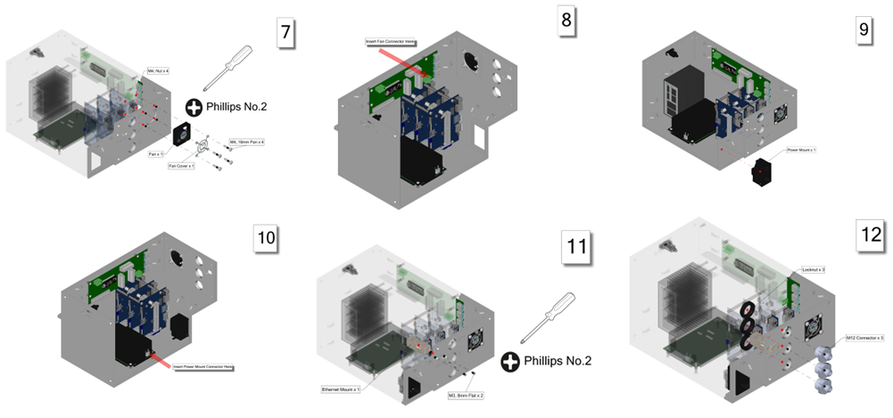{width="6.673611111111111in"
height="3.127083333333333in"}

Figure 17 Steps 7 to 12 of the enclosure assembly.

Step 13 involves wiring the 6 pin connectors to the assigned terminal on
the power distribution board. Steps 14 and 15 are for mounting two
standoff cubes. Step 16 will require a custom cable made from two 14 pin
plugs. The cable will need to have 28 pins, two 14 pin plugs, 20 gauge
wire, and require the Molex hand crimper. Step 17 connects the three SBC
units to the power distribution board using USB A to C cables. Step 18
connects the three SBC units to the switch via 2ft ethernet cables.
Steps 13 to 18 are shown in Figure 18.

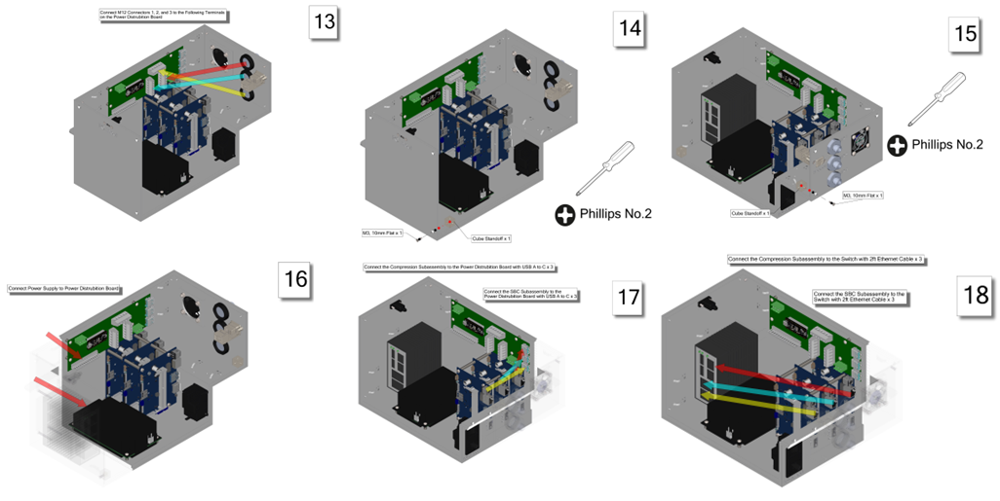{width="6.840277777777778in"
height="3.433333333333333in"}

Figure 18 Steps 13 to 18 of the enclosure assembly.

Step 19 will connect the ethernet mount to the switch via a 1ft cable. A
custom cable with two 3 pin plugs connects the power distribution board
to the switch. The cable will have 6 pins, two 3 pin plugs, 20 gauge
wire and require the Molex crimper. Now all connections inside the PCM
are complete and it is operational. The last two steps will be to
install the side panel and top panel subassemblies to finish the
enclosure. These steps are shown in figure 19. The finished assembly of
the PCM is shown in Figure 20.

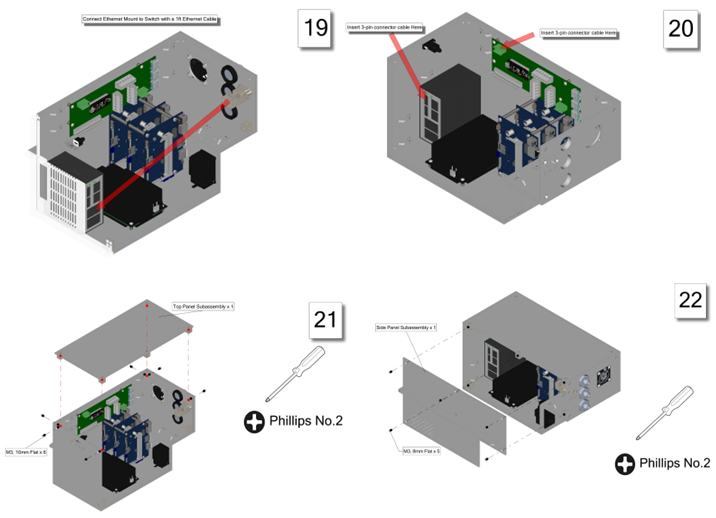{width="4.773611111111111in"
height="3.453472222222222in"}

Figure 19 Steps 19 to 22 of the enclosure assembly.

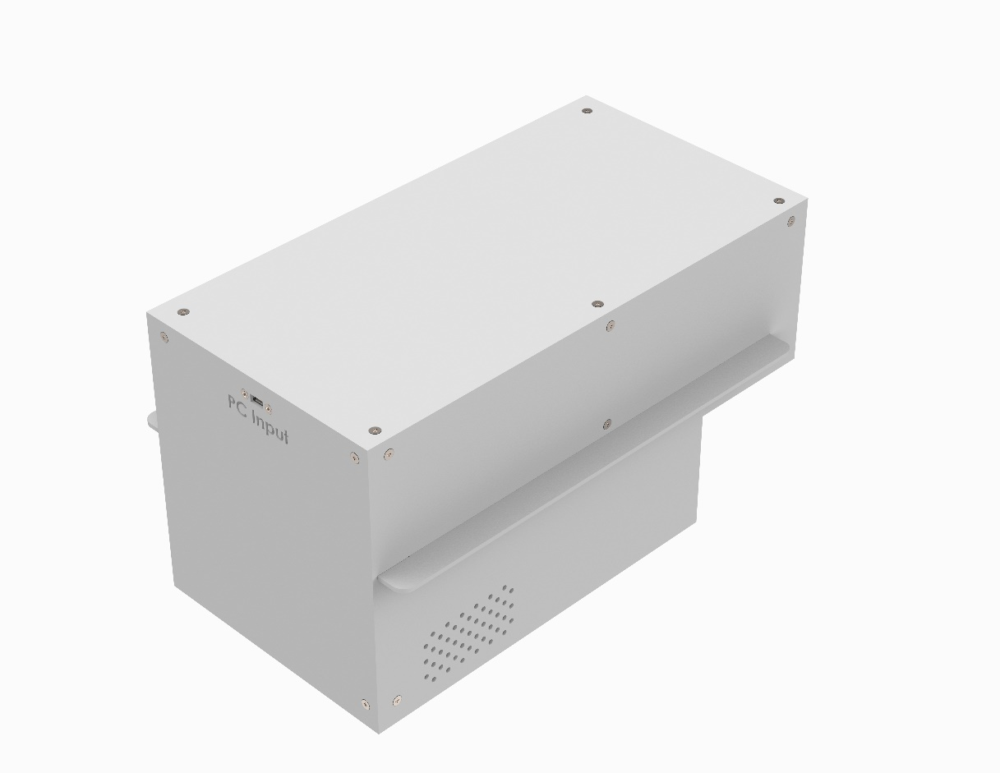{width="5.524133858267716in"
height="3.6969695975503063in"}

Figure 20 Finished PCM assembly.

# Modular Rack Assembly

## Modular Rack Overview

The modular rack is responsible for securing the three Monitoring Cage
units and PCM in place for testing. The rack is non ventilated and is
designed to be used in a high density format. The modular rack setup
will allow for easy removal of Monitoring Cage units for repairs,
maintenance, animal care, etc.

## Modular Rack Fabrication

To assemble the modular rack, several parts will need to be custom
fabricated. Three Runner Support Bars (8975K582, McMaster-Carr,
Elmhurst, IL) will need to be machined. Two Igloo Bars (8975K582,
McMaster-Carr, Elmhurst, IL) will also need to be machined. In this
fabrication process, a waterjet was used to fabricate the bars. Two
runner bar brackets will need to be 3D printed. In this fabrication
process, the Markforged X7 (Waltham, MA) was used to print the parts out
of Onyx.

## Modular Rack Assembly

The bill of materials for the assembly of the Modular Rack is shown in
Table 3. Items that were custom made have .STL files to reference on the
Github page. The other items were purchased from vendors.

Table 3 Bill of materials for the Modular Rack assembly.

  ----------------------------------------------------------------------------------------------------------------------------------
  ITEM NO.  Part Label  Description                                             Source          Vendor Part       Qty   Cost
                                                                                                Number                  
  --------- ----------- ------------------------------------------------------- --------------- ----------------- ----- ------------
  1         Cage Runner NIEHS CAN K10000 Kit, Runners, NexGen, Left/Right,      Allentown Inc.  K10000            4     \$216.00
                        Hardware, Glass Filled Polysulfone High Temperature                                             
                        Plastic, Purple                                                                                 

  2         Cross Bar   1 x 1 x 16.5 inches T-Slotted profile - Four Open       80/20           8020-1010-black x 10    \$167.90
                        T-slots                                                                 16.5                    

  3         Side Bar    1 x 1 x 15.5 inches T-Slotted profile - Four Open       80/20           8020-1010-black x 6     \$97.62
                        T-slots                                                                 15.5                    

  4         Vertical    1 x 1 x 30 inches T-Slotted profile - Four Open T-slots 80/20           8020-1010-black x 4     \$55.24
            Bar                                                                                 30                      

  5         Corner      10 Series 2 Hole - Gusseted Inside Corner Bracket       80/20           8020-4132-black   16    \$130.88
            Bracket                                                                                                     

  6         1/4\"-20,   1/4-20 x .500\" Button Head Socket Cap Screw (BHSCS)    80/20           8020-3061         38    \$12.92
            1/2\" Pan                                                                                                   

  7         1/4\"-20    1/4-20 Roll-In T-Nut with Ball Spring                   80/20           8020-3923         42    \$102.48
            T-Nut                                                                                                       

  8         Igloo Bar   24\" x 2\" x 1/8\" (L x W x H) metal bar                McMaster-Carr   8975K582          2     \$14.10

  9         Locking     10 Series 90 Degree Structural Right Angle Pivot Nub    80/20           8020-4002-black   4     \$44.00
            Clamp                                                                                                       

  10        Corner      10 series 3-Way Square Corner Connector                 80/20           8020-4042-Black   8     \$265.84
            Connector                                                                                                   

  11        1/4\"-20,   1/4-20 x 1.000\" Low Head Socket Cap Screw (LHSCS)      80/20           8020-3017         24    \$18.72
            1\" Pan                                                                                                     

  12        M4 T-Nut    M4 roll-in T-nut with ball spring                       80/20           8020-3919         16    \$39.04

  13        M4, 10mm    Black-Oxide Alloy Steel Socket Head Screw M4 x          McMaster-Carr   91290A144         16    \$1.80
            Pan         0.7 mm Thread, 10 mm Long                                                                       

  14        Runner      36\" x 2\" x 1/8\" (L x W x H) metal bar                McMaster-Carr   8975K582          3     \$29.40
            Support Bar                                                                                                 

  15        1/4\"-20    Zinc Yellow-Chromate Plated Steel Oversized Washer      McMaster-Carr   98025A029         1     \$0.20
            Washer      Grade 8, for 1/4\" Screw Size, 0.281\" ID, 0.625\" OD                                           

  16        Runner Bar  3D Printed FDM                                          3D printed      N/A - refer to    2     \$8.00
            Bracket                                                                             STL file                

  17        1/4\"-20,   82 Degree Countersink, 1/4\"-20 Thread, 3/4\" Long,     McMaster-Carr   96640A286         1     \$14.37
            3/4\" Flat  Undercut                                                                                        

  Total                                                                                                                 \$1,218.51
  Cost Per                                                                                                              
  Modular                                                                                                               
  Rack                                                                                                                  
  ----------------------------------------------------------------------------------------------------------------------------------

#### Rack Top Subassembly

To make the assembly of the modular rack more user friendly, it is best
to assemble subassemblies of the rack. There are three subassemblies:
the rack top, base, mid bar, and rear bar. They can be completed in any
order. For the modular rack, one top subassembly is required. A 1/8",
5/32", and 3/16" Allen key are required for assembly. First the runner
bar bracket will be secured to a cross bar 195mm from the edge of the
crossbar. Second, two corner brackets will be secured to the opposite
side of the cross bar. Next two side bars will slide onto each face end
of the cross bar. Secure the cross bar 312mm offset from one end of the
side bar. Please refer to Figure 21 for steps 1 to 4 of the rack top
subassembly.

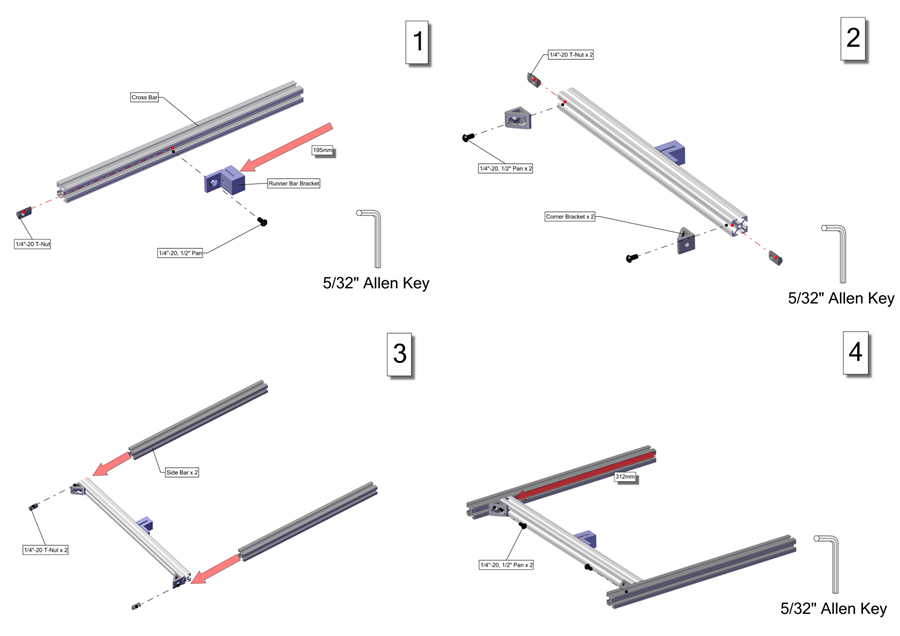{width="5.660661636045495in"
height="4.0in"}

Figure 21 Steps 1 to 4 of the rack top subassembly.

Two ¼"-20 T-Nuts will slide into the inner rails of the side bars. Do
not secure these T-nuts, they will be secured in a later step. Next
slide two T-nuts (a part of the Locking Clamp assembly, P/N
8020-4002-black, Allentown Inc., Allentown, NJ) and an Igloo bar on the
inside rails of the side bars. Secure the igloo bar in place
approximately 78mm offset from the side bar face end. The igloo bar is
secured by the rest of the Locking Clamp (P/N 8020-4002-black, Allentown
Inc., Allentown, NJ). Next fasten two corner brackets onto each face end
of two new cross bars. Please refer to Figure 22 for steps 5 to 8 of the
rack top subassembly.

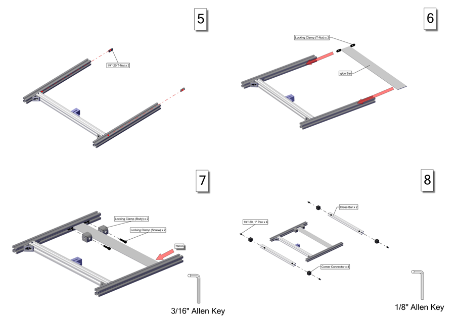{width="5.660661636045495in"
height="4.0in"}

Figure 22 Steps 5 to 8 of the rack top subassembly.

The final step involves fastening the cross bars with the corner
connectors to the face ends of the side bars. The final step and
resulting rack top subassembly can be found in Figure 23.

{width="6.000694444444444in"
height="2.120138888888889in"}

Figure 23 Step 9 and finished version of the rack top subassembly.

#### Rack Base Subassembly

For the modular rack, one base subassembly is required. A 1/8" and 5/32"
Allen key are required for assembly. First the runner bar bracket will
be secured to a cross bar 195mm from the edge of the crossbar. Second,
two corner brackets will be secured to the opposite side of the cross
bar. Next two side bars will slide onto each face end of the cross bar.
Secure the cross bar 312mm offset from one end of the side bar. Please
refer to Figure 24 for steps 1 to 4 of the rack base subassembly.

{width="5.660661636045495in"
height="4.0in"}

Figure 24 Figure 20 Steps 1 to 4 of the rack base subassembly.

Two ¼"-20 T-Nuts will slide into the inner rails of the side bars. Do
not secure these T-nuts, they will be secured in a later step. Next
fasten two corner brackets onto each face end of two new cross bars. The
final step involves fastening the cross bars with the corner connectors
to the face ends of the side bars. The final steps 5 to 9 and resulting
rack base subassembly can be found in Figure 25.

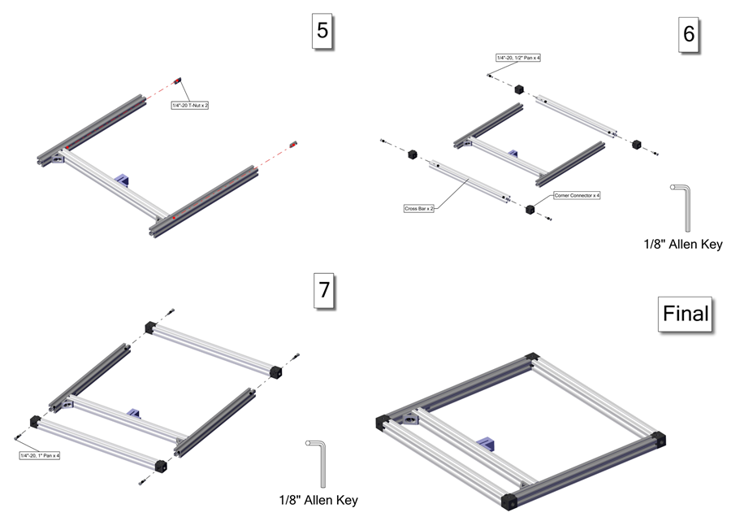{width="5.660661636045495in"
height="4.0in"}

Figure 25 Steps 5 to 7 and the finished version of the rack base
subassembly.

#### Rack Mid Bar Subassembly

For the modular rack, one mid bar subassembly is required. A 5/32" and
3/16" Allen key are required for assembly. First slide two T-nuts (a
part of the Locking Clamp assembly, P/N 8020-4002-black, Allentown Inc.,
Allentown, NJ) and an Igloo bar on the inside rails of the side bars.
Secure the igloo bar in place approximately 78mm offset from the side
bar face end. The igloo bar is secured by the rest of the Locking Clamp
(P/N 8020-4002-black, Allentown Inc., Allentown, NJ). Next on the bottom
side of the side bars, secure four corner brackets flesh to the face
ends of the side bars. The assembly steps 1 to 3 and resulting rack mid
bar subassembly can be found in Figure 26.

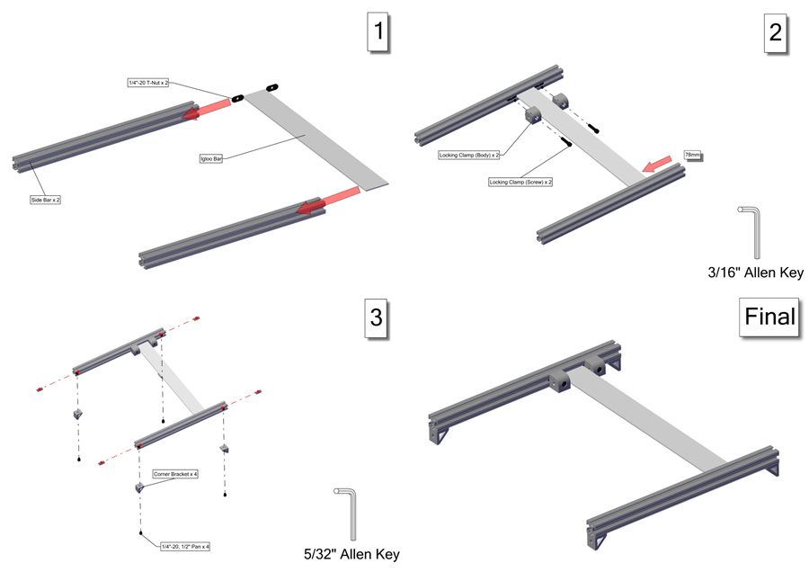{width="5.660661636045495in"
height="4.0in"}

Figure 26 Assembly steps and the finished version of the rack mid bar
subassembly.

#### Rack Rear Bar Subassembly

Four mid bar subassemblies are required for one modular rack. A 5/32"
Allen key is required for assembly. On the top side of the cross bar,
secure two corner brackets flesh to the face ends of the cross bars.
Next slide four M4 T-Nuts onto the front rail of the cross bar. Do not
secure these t-nuts yet. The assembly steps and resulting rack rear bar
subassembly can be found in Figure 27. Repeat these steps to make four
mid bar subassemblies in total.

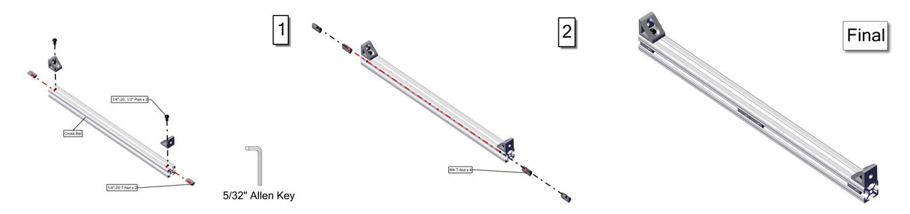{width="6.0in"
height="1.4133169291338583in"}

Figure 27 Assembly steps and the finished version of the rack rear bar
subassembly.

#### Rack Assembly 

Once all the subassemblies are completed for the modular rack, then the
final rack can be assembled. A 1/8", 5/32", and 3mm Allen key and a No.
2 Phillips screwdriver are required for assembly. First fasten the four
vertical bars to the base subassembly. Second, install the mid bar
subassembly and fasten it 350mm above the base subassembly. Next install
one rear bar subassembly between the two rear vertical posts. Make sure
the corner brackets are on the bottom side of the rear bar subassembly
and they are touching the base subassembly. Please refer to Figure 28
for steps 1 to 4 of the rack assembly.

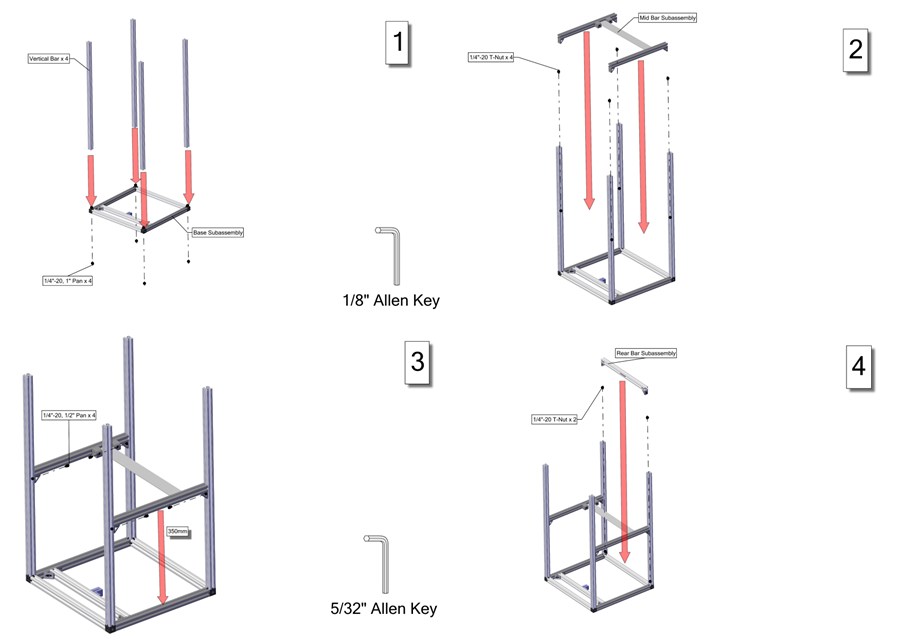{width="5.660661636045495in"
height="4.0in"}

Figure 28 Steps 1 to 4 of the rack assembly.

The next step is to install the second rear bar sub assembly between the
two rear vertical posts. Make sure the corner brackets are on the top
side of the rear bar subassembly. Leave a 78mm gap between the first and
second rear cross bars. Please refer to Figure 29 for steps 5 to 8 of
the rack assembly.

{width="5.660661636045495in"
height="4.0in"}

Figure 29 Steps 5 to 8 of the rack assembly.

A third rear bar sub assembly will need to be installed between the two
rear vertical posts. Make sure the corner brackets are on the bottom
side of the rear bar subassembly. Leave a 260mm gap between the second
and third rear cross bars. The final rear bar sub assembly will need to
be installed between the two rear vertical posts. Make sure the corner
brackets are on the top side of the rear bar subassembly. Leave a 78 mm
gap between the third and final rear cross bars. Next fasten the top sub
assembly to the top faces of the four vertical bars. Please refer to
Figure 30 for steps 9 to 12 of the rack assembly.

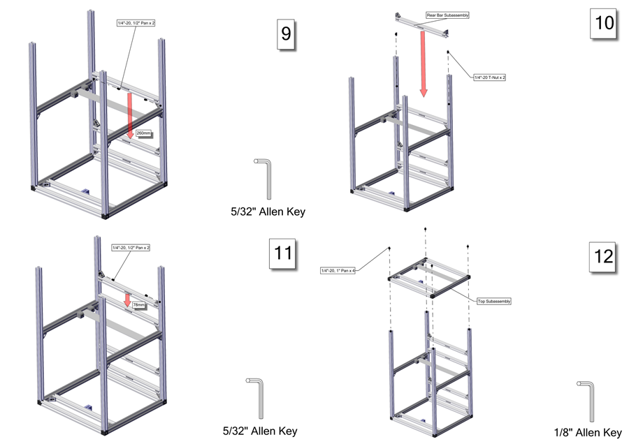{width="5.660661636045495in"
height="4.0in"}

Figure 30 Steps 9 to 12 of the rack assembly.

Next fasten one runner support to the left side bar on both the top and
base subassemblies. Make sure the runner support bar is square with the
two cross bars on both the top and base subassemblies. Slide another
runner support bar in between the two runner bar brackets and secure
with ¼"-20, ¾" flat screws. Fasten the last runner support to the right
side bar on both the top and base subassemblies. Make sure the runner
support bar is square with the two cross bars on both the top and base
subassemblies. Next install a left and right cage runner. Make sure the
dimples on the runners match with the cutouts on the runner support
bars. The cage runners will be fastened to the M4 T-Nuts in the two
lower rear bar subassemblies. Please refer to Figure 31 for steps 13 to
16 of the rack assembly.

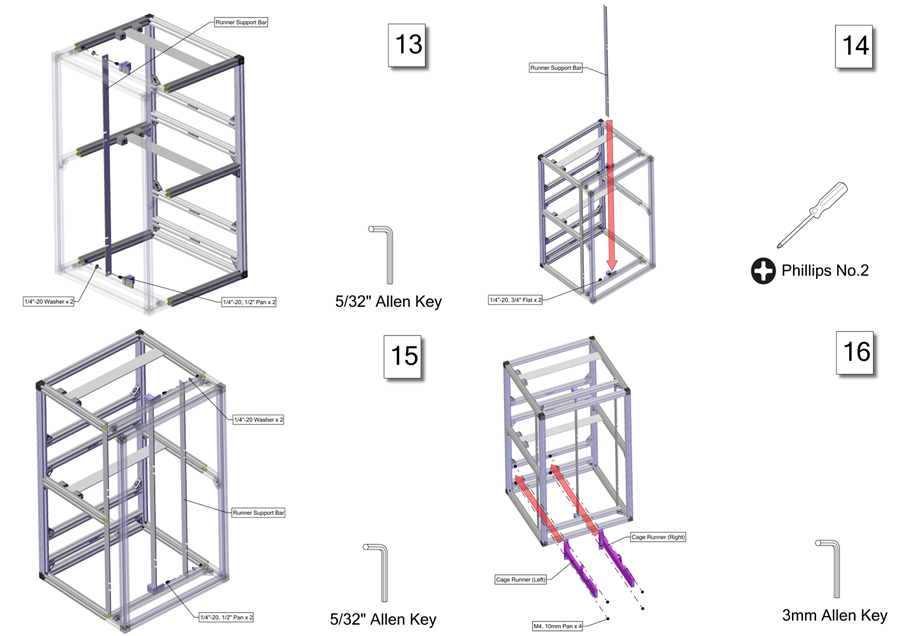{width="5.660661636045495in"
height="4.0in"}

Figure 31 Steps 13 to 16 of the rack assembly.

Three more sets of a left and right cage runners will need to be
installed. Make sure the dimples on the runners match with the cutouts
on the runner support bars. The cage runners will be fastened to the M4
T-Nuts in the rear bar subassemblies. Please refer to Figure 32 for
steps 17 to 19 and the finished version of the rack assembly.

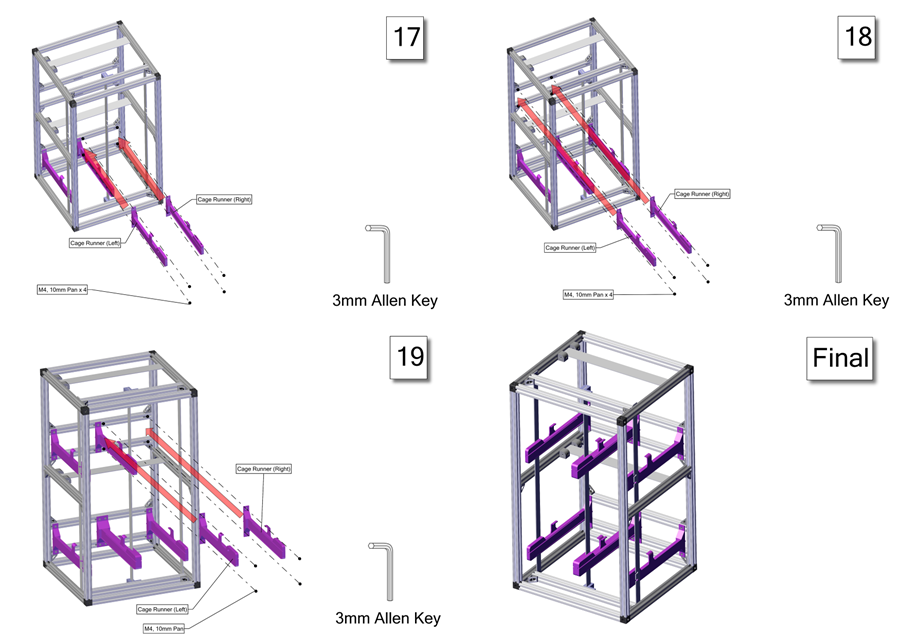{width="5.660661636045495in"
height="4.0in"}

Figure 32 Assembly steps 17 to 19 and the finished version of the
modular rack assembly.

# Appendix -- Step by Step Instructions

## Monitoring Cage Assembly

### Hopper Assembly

{width="5.657298775153106in"
height="4.0in"}

{width="5.6572976815398075in"
height="4.0in"}

{width="5.657298775153106in"
height="4.0in"}

{width="5.6572976815398075in"
height="4.0in"}

### Igloo Assembly 

{width="5.657298775153106in"
height="4.0in"}

{width="5.657298775153106in"
height="4.0in"}

{width="5.657298775153106in"
height="4.0in"}

{width="5.657298775153106in"
height="4.0in"}

{width="5.657298775153106in"
height="4.0in"}

{width="5.657298775153106in"
height="4.0in"}

{width="5.657298775153106in"
height="4.0in"}

{width="5.657298775153106in"
height="4.0in"}

{width="5.657298775153106in"
height="4.0in"}

### Monitoring Cage Unit Assembly

{width="5.657298775153106in"
height="4.0in"}{width="5.657298775153106in"
height="4.0in"}{width="5.657298775153106in"
height="4.0in"}{width="5.657298775153106in"
height="4.0in"}{width="5.657298775153106in"
height="4.0in"}

## Power and Control Module (PCM) 

[]{#_Toc147213275 .anchor}Side Panel Subassembly

{width="5.356178915135608in"
height="4.0in"}{width="6.742818241469816in"
height="4.0in"}

{width="6.427409230096238in"
height="4.0in"}{width="5.678094925634296in"
height="4.0in"}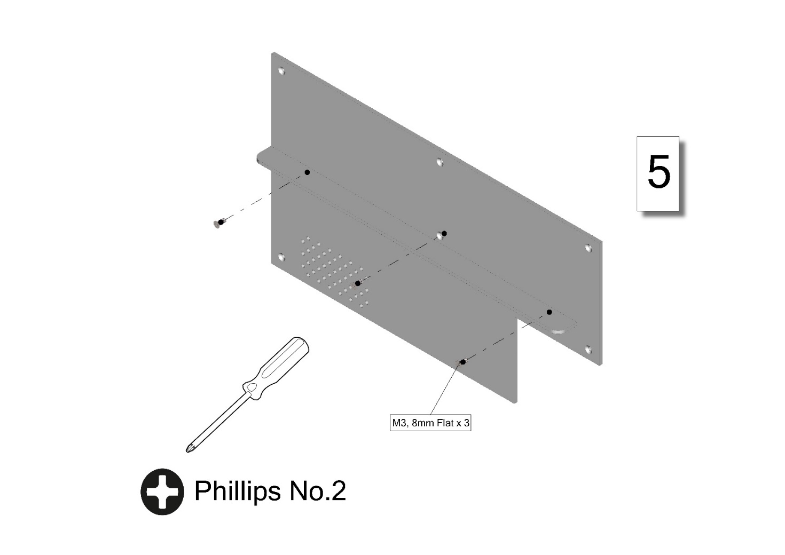{width="5.531424978127734in"
height="4.0in"}{width="6.640029527559055in"
height="4.0in"}

### Top Panel Subassembly

{width="5.131104549431321in"
height="4.0in"}{width="6.291666666666667in"
height="3.9993055555555554in"}

### Power Supply Subassembly

{width="6.7728291776028in"
height="4.0in"}

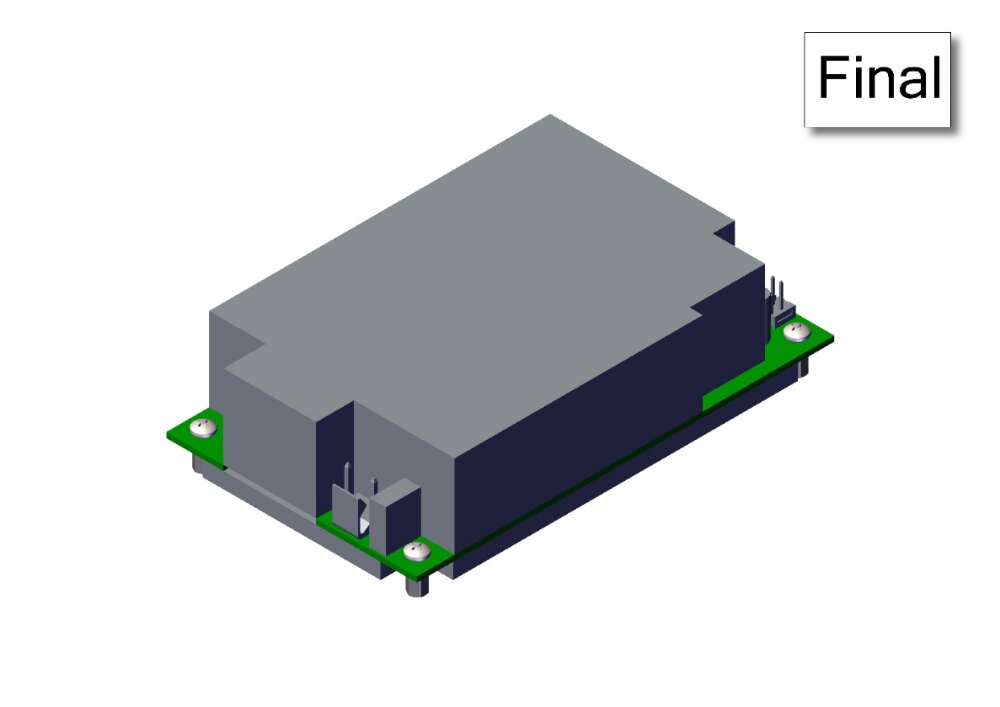{width="5.6571205161854765in"
height="4.0in"}

### Power Distribution Board Subassembly

{width="6.439989063867016in"
height="4.0in"}

{width="5.6571205161854765in"
height="4.0in"}

### SBC Subassembly

{width="6.04759842519685in"
height="4.0in"}{width="5.6571205161854765in"
height="4.0in"}

{width="5.6571205161854765in"
height="4.0in"}{width="6.366107830271216in"
height="4.0in"}

### PCM Main Body Assembly

{width="6.540286526684165in"
height="4.0in"}{width="6.34078302712161in"
height="4.0in"}{width="5.9089041994750655in"
height="4.0in"}{width="5.7615901137357834in"
height="4.0in"}{width="5.6571205161854765in"
height="4.0in"}{width="6.52629593175853in"
height="4.0in"}{width="5.657119422572179in"
height="4.0in"}{width="6.069858923884515in"
height="4.0in"}{width="5.657119422572179in"
height="4.0in"}{width="6.165812554680665in"
height="4.0in"}{width="5.657119422572179in"
height="4.0in"}{width="6.595985345581802in"
height="4.0in"}{width="5.954010279965004in"
height="4.0in"}{width="5.657119422572179in"
height="4.0in"}

{width="6.459422572178478in"
height="4.0in"}{width="6.379686132983377in"
height="4.0in"}{width="6.554414916885389in"
height="4.0in"}{width="6.252307524059493in"
height="4.0in"}

{width="6.071262029746282in"
height="4.0in"}{width="5.657119422572179in"
height="4.0in"}{width="5.6571205161854765in"
height="4.0in"}{width="6.347713254593176in"
height="4.0in"}{width="5.657119422572179in"
height="4.0in"}

## Modular Rack Assembly

### Rack Top Subassembly

{width="5.657298775153106in"
height="4.0in"}{width="5.657298775153106in"
height="4.0in"}{width="5.657298775153106in"
height="4.0in"}{width="5.657298775153106in"
height="4.0in"}{width="5.657298775153106in"
height="4.0in"}{width="5.657298775153106in"
height="4.0in"}{width="5.657298775153106in"
height="4.0in"}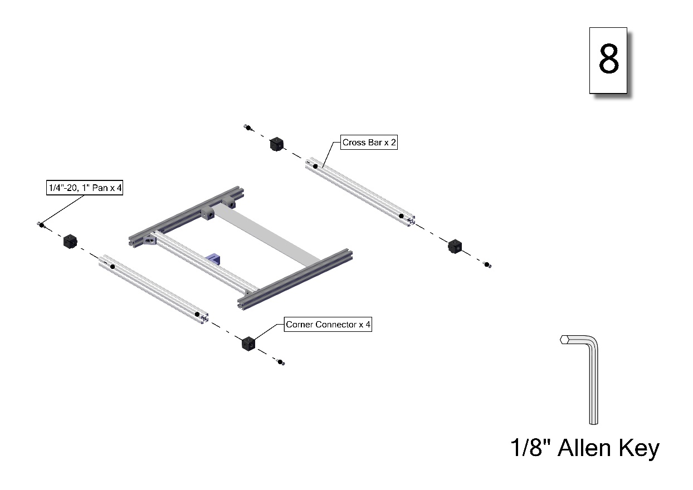{width="5.657298775153106in"
height="4.0in"}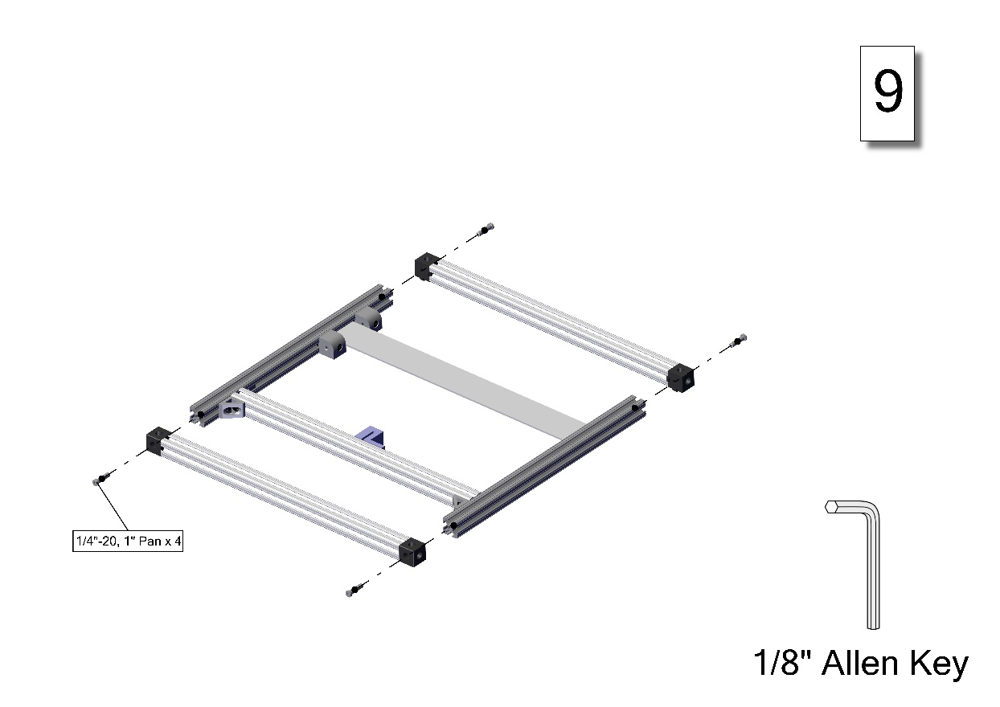{width="5.657298775153106in"
height="4.0in"}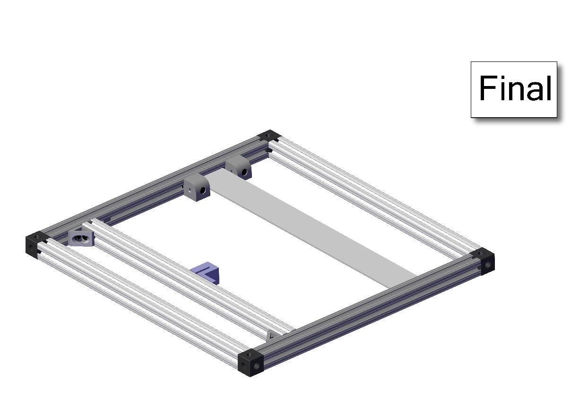{width="5.657298775153106in"
height="4.0in"}

### Rack Base Subassembly

{width="5.657298775153106in"
height="4.0in"}{width="5.657298775153106in"
height="4.0in"}{width="5.657298775153106in"
height="4.0in"}{width="5.657298775153106in"
height="4.0in"}{width="5.657298775153106in"
height="4.0in"}{width="5.657298775153106in"
height="4.0in"}{width="5.657298775153106in"
height="4.0in"}{width="5.657298775153106in"
height="4.0in"}

### Rack Mid Bar Subassembly 

{width="5.657298775153106in"
height="4.0in"}{width="5.657298775153106in"
height="4.0in"}{width="5.657298775153106in"
height="4.0in"}{width="5.657298775153106in"
height="4.0in"}

### Rack Rear Bar Subassembly

{width="5.657458442694663in"
height="4.0in"}

{width="5.657458442694663in"
height="4.0in"}

{width="5.657298775153106in"
height="4.0in"}

### Rack Assembly 

{width="5.657298775153106in"
height="4.0in"}{width="5.657298775153106in"
height="4.0in"}{width="5.657298775153106in"
height="4.0in"}{width="5.657298775153106in"
height="4.0in"}{width="5.657298775153106in"
height="4.0in"}{width="5.657298775153106in"
height="4.0in"}{width="5.657298775153106in"
height="4.0in"}{width="5.657298775153106in"
height="4.0in"}{width="5.657298775153106in"
height="4.0in"}{width="5.657298775153106in"
height="4.0in"}{width="5.657298775153106in"
height="4.0in"}{width="5.657298775153106in"
height="4.0in"}{width="5.657298775153106in"
height="4.0in"}{width="5.657298775153106in"
height="4.0in"}{width="5.657298775153106in"
height="4.0in"}{width="5.657298775153106in"
height="4.0in"}{width="5.657298775153106in"
height="4.0in"}{width="5.657298775153106in"
height="4.0in"}{width="5.657298775153106in"
height="4.0in"}{width="5.657298775153106in"
height="4.0in"}
