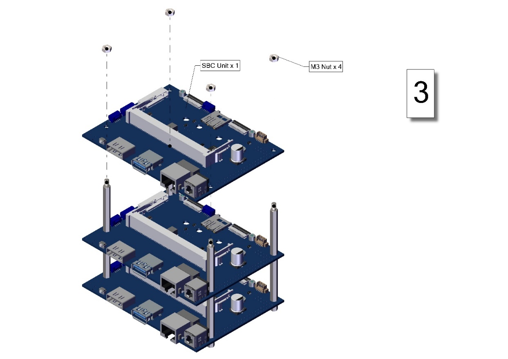

# System for Continuous Observation of Rodents in Home-cage Environment (SCORHE) Instructions for Assembly

# Table of Contents

[SCORHE System Overview
[4](#scorhe-system-overview)](#scorhe-system-overview)

[The SAHM Assembly [4](#the-sahm-assembly)](#the-sahm-assembly)

[SAHM Overview [4](#sahm-overview)](#sahm-overview)

[SAHM Fabrication [5](#sahm-fabrication)](#sahm-fabrication)

[Modified Lid Fabrication
[5](#modified-lid-fabrication)](#modified-lid-fabrication)

[Hopper Fabrication [5](#hopper-fabrication)](#hopper-fabrication)

[Igloo Fabrication [5](#igloo-fabrication)](#igloo-fabrication)

[SAHM Assembly [6](#sahm-assembly)](#sahm-assembly)

[Hopper Assembly [7](#hopper-assembly)](#hopper-assembly)

[Igloo Assembly [8](#igloo-assembly)](#igloo-assembly)

[Finished SAHM Unit Assembly
[10](#finished-sahm-unit-assembly)](#finished-sahm-unit-assembly)

[The Control Center Assembly
[12](#the-control-center-assembly)](#the-control-center-assembly)

[Control Center Overview
[12](#control-center-overview)](#control-center-overview)

[System Fabrication [13](#system-fabrication)](#system-fabrication)

[Enclosure Fabrication
[13](#enclosure-fabrication)](#enclosure-fabrication)

[Control Center Assembly
[13](#control-center-assembly)](#control-center-assembly)

[Side and Top Panel Assemblies
[16](#side-and-top-panel-assemblies)](#side-and-top-panel-assemblies)

[Electronic Subassemblies
[17](#electronic-subassemblies)](#electronic-subassemblies)

[Main Body Assembly [19](#main-body-assembly)](#main-body-assembly)

[Modular Rack Assembly
[23](#modular-rack-assembly)](#modular-rack-assembly)

[Modular Rack Overview
[23](#modular-rack-overview)](#modular-rack-overview)

[Modular Rack Fabrication
[23](#modular-rack-fabrication)](#modular-rack-fabrication)

[Modular Rack Assembly
[23](#modular-rack-assembly-1)](#modular-rack-assembly-1)

[Appendix – Step by Step Instructions
[35](#appendix-step-by-step-instructions)](#appendix-step-by-step-instructions)

[SAHM Assembly [35](#sahm-assembly-1)](#sahm-assembly-1)

[Hopper Assembly [35](#hopper-assembly-1)](#hopper-assembly-1)

[Igloo Assembly [37](#igloo-assembly-1)](#igloo-assembly-1)

[SAHM Unit Assembly [42](#sahm-unit-assembly)](#sahm-unit-assembly)

[Control Center [44](#control-center)](#control-center)

[Side Panel Subassembly [44](#_Toc144982149)](#_Toc144982149)

[Top Panel Subassembly
[48](#top-panel-subassembly)](#top-panel-subassembly)

[Power Supply Subassembly
[49](#power-supply-subassembly)](#power-supply-subassembly)

[Power Distribution Board Subassembly
[50](#power-distribution-board-subassembly)](#power-distribution-board-subassembly)

[SBC Subassembly [51](#sbc-subassembly)](#sbc-subassembly)

[Control Center Main Body Assembly
[53](#control-center-main-body-assembly)](#control-center-main-body-assembly)

[Modular Rack Assembly
[65](#modular-rack-assembly-2)](#modular-rack-assembly-2)

[Rack Top Subassembly
[65](#rack-top-subassembly-1)](#rack-top-subassembly-1)

[Rack Base Subassembly
[70](#rack-base-subassembly-1)](#rack-base-subassembly-1)

[Rack Mid Bar Subassembly
[74](#rack-mid-bar-subassembly-1)](#rack-mid-bar-subassembly-1)

[Rack Rear Bar Subassembly
[76](#rack-rear-bar-subassembly-1)](#rack-rear-bar-subassembly-1)

[Rack Assembly [78](#rack-assembly-1)](#rack-assembly-1)

# 

# SCORHE System Overview

The System for Continuous Observation of Rodents in Home-Cage
Environment (SCORHE) is an open-source system for housing and monitoring
rodents for experiments. The SCORHE system fits inside a custom modular
rack that houses all the components for running the system. The
monitoring cages or Open-Source System for Automated Home-cage
Monitoring (SAHM) units are where the rodents are monitored. There are
three SAHM units per SCORHE system. Each SAHM unit has subassemblies
including an Igloo and Hopper that must be assembled. The Igloo supports
the camera and LEDs above the mouse lid. The hopper is specially
designed to fit into the mouse cages and supply food and water. One
Control Center will need to be fabricated for every SCORHE system. The
Control Center is responsible for powering and housing electronics to
run the SCORHE system. Figure 1 shows the components of the SCORHE
system.

Figure Fully assembled SCORHE system.

This document is organized into subassemblies to build the final SCORHE
system. Each subassembly has a fabrication and assembly section. Each
subassembly has a bill of materials for one subassembly unit. In the
appendix, larger figures of all assembly steps are shown.

# The SAHM Assembly

## SAHM Overview

The Open-Source System for Automated Home-cage Monitoring (SAHM) units
are where the rodents are monitored. These instructions are for one SAHM
unit and must be repeated two more times for each SCORHE system. The
SAHM unit has subassemblies called the Igloo and Hopper that must be
assembled before assembling the final SAHM unit.

Figure The final SAHM unit Assembly

## SAHM Fabrication

### Modified Lid Fabrication

A solid clear NexGen lid (P/N: 228790-1, Allentown Inc, Allentown, NJ)
will need to be modified to support the SAHM system. A DXF file can be
found on the Github page, and it will need to cut into the lid. In this
fabrication process, a waterjet was used to make the cuts into the lid.
In this process, a single pass of the waterjet was used even for the
varying heights of the lid.

### Hopper Fabrication

The two-compartment hopper was designed to house food pellets and a
water bottle inside the NexGen standard cage (P/N: 223581-4, Allentown
Inc, Allentown, NJ). The hopper must be injection molded (ICOMold Inc.,
Hartland, WI) from a food safe, autoclavable material (PSU Ultrason
S3010, BASF, Ludwigshafen, Germany). The food grate (304SS, 26-gauge,
Yarde Metal, White Marsh, MD) is fabricated with a waterjet and bending
tool. The bottle holder (304SS, 24-gauge, Yarde Metal, White Marsh, MD)
is fabricated with a waterjet.

### Igloo Fabrication

The igloo consists of five clear acrylic panels fixed together to
support a camera above the mouse cage. The acrylic panels (Clear Cast
Acrylic-1/4”, Piedmont Plastics, Elkridge, Maryland) must be cut. In
this fabrication process a CO2 laser cutter (PLS6.150D,
Universal Laser Systems) was used for cutting the panels. Holes on the
panels will need to be countersink with a 90° Countersink drill bit. Two
holes on the top panel will need to be tapped for 4-40 threads. The
handle and camera bracket will need to be 3D printed. In this
fabrication process, the Markforged X7 (Waltham, MA) was used to print
the parts out of Onyx.

## SAHM Assembly

The bill of materials for the assembly of one SAHM unit is shown in
Table 1. The mouse cage lid must be modified before assembling the SAHM
unit. Items that were custom made have .STP or .DXF or .STL files to
reference on the Github page. All other items were purchased from
vendors.

<table>
<caption>
Bill of materials for the assembly of one SAHM
unit.
</caption>
<colgroup>
<col style="width: 7%" />
<col style="width: 15%" />
<col style="width: 22%" />
<col style="width: 14%" />
<col style="width: 17%" />
<col style="width: 8%" />
<col style="width: 14%" />
</colgroup>
<tbody>
<tr class="odd">
<td>ITEM NO.</td>
<td>Part Label</td>
<td>Description</td>
<td>Source</td>
<td>Vendor Part Number</td>
<td>Qty</td>
<td>Cost</td>
</tr>
<tr class="even">
<td>1</td>
<td>Mouse Cage Base</td>
<td>MOUSE, XJ/NEXGEN, CLEAR POLYSULFONE HIGH TEMPERATURE PLASTIC, WHITE
AIR KUP</td>
<td>Allentown Inc.</td>
<td>223581-4</td>
<td>1</td>
<td>$48.60</td>
</tr>
<tr class="odd">
<td>2</td>
<td>Mouse Cage Lid</td>
<td>MICRO BARRIER TOP, MOUSE, NEXGEN, SOLID, CLEAR POLYSULFONE HIGH
TEMPERATURE PLASTIC, NO LOCKS</td>
<td>Allentown Inc.</td>
<td>228790-1</td>
<td>1</td>
<td>$139.50</td>
</tr>
<tr class="even">
<td>3</td>
<td>Water bottle</td>
<td> Bottle Udel 9 oz., Ink with "O" Ring</td>
<td>Thoren Caging Systems, Inc.</td>
<td>BW09UIRNO</td>
<td>1</td>
<td>$7.11</td>
</tr>
<tr class="odd">
<td>4</td>
<td>Sipper Tube</td>
<td>Stainless steel with 2 1/2" welded bent sipper tube</td>
<td>Thoren Caging Systems, Inc.</td>
<td>BWCS250HSB</td>
<td>1</td>
<td>$3.79</td>
</tr>
<tr class="even">
<td>5</td>
<td>Hopper</td>
<td>PSU Ultrason S3010</td>
<td>Injection Molded</td>
<td>N/A - refer to STP file</td>
<td>1</td>
<td>$92.19</td>
</tr>
<tr class="odd">
<td>6</td>
<td>Stainless Steel Grommet</td>
<td>Stainless Steel Fabric Grommets with Washer</td>
<td>McMaster-Carr</td>
<td>96015K33</td>
<td>1</td>
<td>$16.68</td>
</tr>
<tr class="even">
<td>7</td>
<td>Food Grate</td>
<td>304SS, 26 Gauge stock piece</td>
<td>Waterjet Cut</td>
<td>N/A - refer to DXF file</td>
<td>1</td>
<td></td>
</tr>
<tr class="odd">
<td>8</td>
<td>Bottle Holder</td>
<td>304SS, 24 Gauge stock piece</td>
<td>Waterjet Cut</td>
<td>N/A - refer to DXF file</td>
<td>1</td>
<td></td>
</tr>
<tr class="even">
<td>9</td>
<td>4-40, 3/8" Flat</td>
<td>Passivated 18-8 Stainless Steel Phillips Flat Head Screw</td>
<td>McMaster-Carr</td>
<td>91099A165</td>
<td>2</td>
<td>$5.55</td>
</tr>
<tr class="odd">
<td>10</td>
<td>Camera</td>
<td>Depth Camera D435</td>
<td>Intel Inc.</td>
<td>D435</td>
<td>1</td>
<td>$314.00</td>
</tr>
<tr class="even">
<td>11</td>
<td>Camera Bracket</td>
<td>3D Printed FDM</td>
<td>3D printed</td>
<td>N/A - refer to STL file</td>
<td>1</td>
<td>$3.00</td>
</tr>
<tr class="odd">
<td>12</td>
<td>1/4"-20, 3/8" Flat</td>
<td>Passivated 18-8 Stainless Steel Phillips Flat Head Screw</td>
<td>McMaster-Carr</td>
<td>91771A535</td>
<td>1</td>
<td>$12.13</td>
</tr>
<tr class="even">
<td>13</td>
<td>1/4"-20 Nut</td>
<td>18-8 Stainless Steel Thin Hex Nut</td>
<td>McMaster-Carr</td>
<td>91847A029</td>
<td>2</td>
<td>$6.36</td>
</tr>
<tr class="odd">
<td>14</td>
<td>1/4"-20, 7/8" Flat</td>
<td>Passivated 18-8 Stainless Steel Phillips Flat Head Screw</td>
<td>McMaster-Carr</td>
<td>91099A478</td>
<td>2</td>
<td>$12.99</td>
</tr>
<tr class="even">
<td>15</td>
<td>Handle</td>
<td>3D Printed FDM</td>
<td>3D printed</td>
<td>N/A - refer to STL file</td>
<td>1</td>
<td>$10.00</td>
</tr>
<tr class="odd">
<td>16</td>
<td>M3, 10mm Flat</td>
<td>316 Stainless Steel Phillips Flat Head Screw</td>
<td>McMaster-Carr</td>
<td>91801A156</td>
<td>12</td>
<td>$9.91</td>
</tr>
<tr class="even">
<td>17</td>
<td>Igloo Front Panel</td>
<td>Cut from 12"x24"x1/4" Clear Cast Acrylic</td>
<td>Laser Cut</td>
<td>N/A - refer to DXF file</td>
<td>1</td>
<td>$13.00</td>
</tr>
<tr class="odd">
<td>18</td>
<td>Igloo Side Panel</td>
<td>Cut from 12"x24"x1/4" Clear Cast Acrylic</td>
<td>Laser Cut</td>
<td>N/A - refer to DXF file</td>
<td>2</td>
<td>$13.00</td>
</tr>
<tr class="even">
<td>19</td>
<td>Igloo Top Panel</td>
<td>Cut from 12"x24"x1/4" Clear Cast Acrylic</td>
<td>Laser Cut</td>
<td>N/A - refer to DXF file</td>
<td>1</td>
<td>$13.00</td>
</tr>
<tr class="odd">
<td>20</td>
<td>Cube Standoff</td>
<td>Aluminum M3 Modding Cubes</td>
<td>V1 Tech</td>
<td>N/A</td>
<td>4</td>
<td>$5.00</td>
</tr>
<tr class="even">
<td colspan="6">Total Cost Per SAHM Unit</td>
<td>$725.81</td>
</tr>
</tbody>
</table>

Bill of materials for the assembly of one SAHM unit.

### Hopper Assembly 

The hopper sub assembly should be completed before inserting into the
SAHM unit. The first step involves using a hammer-driven punch (9612K28,
McMaster-Carr, Elmhurst, IL) to lock the stainless steel grommet in
place. The food grate is then inserted and locked in by two tabs.
Lastly, the bottle holder is inserted and locked in via tabs. The hopper
assembly instructions are shown in Figure 3.

Figure The Hopper sub assembly.

### Igloo Assembly 

The igloo sub assembly must be completed before inserting into the SAHM
unit. A Phillips no. 2 screwdriver will be required for fastening all
screws in this section. The first four steps in the igloo assembly are
shown in Figure 4. Four cube standoffs will be fastened to the top panel
with four M3, 10mm flat screws. The rear panel will be secured via two
M3, 10mm flat screws. Next, the 2 side panels will be secured by two M3,
10mm flat screws for each panel.

Figure Steps 1 to 4 of the Igloo sub assembly.

The next step is to fasten the front panel with two M3, 10mm flat
screws. The handle will be secured in place via two ¼”-20, 7/8” flat
screws and two ¼”-20 nuts. The camera is bolted to the camera bracket by
a ¼”-20, 3/8” flat screw. Two 4-40, 3/8” screws are used to fasten the
camera bracket to the igloo. These steps are shown in Figure 5. The
final igloo sub assembly is shown in Figure 6.

Figure Steps 5 to 8 for the Igloo sub assembly.

Figure The final Igloo sub assembly.

### Finished SAHM Unit Assembly 

Once the hopper and igloo assemblies are completed, the SAHM unit can be
constructed. Four steps are required in this process, and they are shown
in Figure 7. The first step is to insert the hopper near the front of
the mouse cage base. Next, the water bottle is inserted into the hopper.
The third step involves securing the hopper in place via a tab on the
mouse cage lid. The blue arrow in step 3 shows the locking tab. The last
step is to insert the igloo to the mouse cage lid by aligning the four
cutouts shown via 4 red arrows. The final SAHM assembly is shown in
Figure 8.

Figure The steps to complete the SAHM assembly.

Figure The final SAHM assembly.

# The Control Center Assembly

## Control Center Overview

The Control Center is responsible for powering, controlling, and data
communication with three SAHM systems to successfully monitor the
rodents. The Control Center is designed to slide into one of the open
slots on the custom racks using 3D printed rails. The Control Center
will have electronic connections in the rear to the three SAHM systems.
Each Control Center has three single board computers (SBC)
(70878-AI-TX2, Auvidea Denklingen, Germany) utilized as compression
units compressing data from one of the SAHM units and sends the data via
ethernet to the network switch (EH2306, ATOP Technologies, Zhubei City,
Taiwan) inside the Control Center. The switch relays the data to an
ethernet panel mount (MRJ-5780-01, Amphenol ICC, Wallingford, CT) on the
Control Center that can be sent to an external storage system for the
user. The Control Center has a power supply (MPB125-4350G, Bel Power
Solutions, New Jersey City, NJ) that connects to a power entry module
(KM01.1105.11, Schurter Inc., Santa Rosa, CA) which can be powered to a
standard AC 110V wall outlet. The power supply is connected to a custom
power distribution board responsible for powering the internal
components of the Control Center. The internal components powered by the
power distribution board include the three SBC compression units, the
ethernet switch, a fan (MF40100V1-1000U-A99, Sunon Fans, Brea, CA) and a
microcontroller (2590, Adafruit Industries LLC, New York, NY). The fan
helps with thermal management by providing airflow through the Control
Center to prevent overheating of the internal components. The
microcontroller allows for controlling auxiliary power options. The
Control Center has multiple connections in the rear as shown in figure
2. Two connections are for the power module and ethernet port. Three
connections are for individual data communication between the Control
Center and each SAHM system. Three 6 pin connectors are available for
auxiliary power for future abilities such as controlling LED lighting on
each of the SAHM systems.

Figure The Control Center backside with electrical connections and fan.

## System Fabrication 

The Control Center was designed using 3D computer-aided design (CAD)
software SolidWorks 2022 (Dassault Systems SolidWorks Corporation,
Concord, NH). ABS material components were printed using a FDM printer
(F370, Stratasys, Rehovot, Israel). Cast acrylic components were cut
from bulk material using a CO2 laser cutter (PLS6.150D,
Universal Laser Systems, Scottsdale, AZ).

## Enclosure Fabrication

The enclosure consists of four parts: the main body, rail, top panel,
and right panel. The top and right panels were fabricated by cutting
them out of 12”x24”x1/8” cast acrylic using a laser cutter. Afterwards
countersinks were drilled into the holes using a 90° Countersink drill
bit. The main body and rail were 3D printed using a FDM 3D printer and
GrabCAD Print software from Stratasys. The print orientation for the
parts at 0.0130-inch slice height is shown in figure 10.

Figure Main body and rail orientation for 3D printing in GrabCAD Print.

## Control Center Assembly

The bill of materials for the assembly of the Control Center is shown in
Table 2. The main body, rail, top panel, and side panel must be
fabricated as previously mentioned. The power distribution board must
also be fabricated. In this design, the power distribution board was
designed in Altium Designer (Altium, San Diego, CA) and fabricated using
a circuit board plotter (LPKF S104, LPKF Laser & Electronics, Garbsen,
Germany). Items that were custom made have .DXF or .STL files to
reference on the Github page. The other items were purchased from
vendors.

<table>
<caption>
Bill of materials for the Control Center
assembly.
</caption>
<colgroup>
<col style="width: 7%" />
<col style="width: 15%" />
<col style="width: 22%" />
<col style="width: 14%" />
<col style="width: 17%" />
<col style="width: 8%" />
<col style="width: 14%" />
</colgroup>
<thead>
<tr class="header">
<th>ITEM NO.</th>
<th>Part Label</th>
<th>Description</th>
<th>Source</th>
<th>Vendor Part Number</th>
<th>Qty</th>
<th>Cost</th>
</tr>
</thead>
<tbody>
<tr class="odd">
<td>1</td>
<td>Main Body</td>
<td>3D Printed FDM</td>
<td>N/A</td>
<td>N/A – refer to STL file</td>
<td>1</td>
<td>$150.00</td>
</tr>
<tr class="even">
<td>9</td>
<td>Rail</td>
<td>3D Printed FDM</td>
<td>N/A</td>
<td>N/A – refer to STL file</td>
<td>1</td>
<td>$3.00</td>
</tr>
<tr class="odd">
<td>10</td>
<td>Top Panel</td>
<td>Cut from 12"x24"x1/8" Cast Acrylic</td>
<td>Laser Cut</td>
<td>N/A – refer to DXF file</td>
<td>1</td>
<td>$13.00</td>
</tr>
<tr class="even">
<td>11</td>
<td>Side Panel</td>
<td>Cut from 12"x24"x1/8" Cast Acrylic</td>
<td>Laser Cut</td>
<td>N/A – refer to DXF file</td>
<td>1</td>
<td>$13.00</td>
</tr>
<tr class="odd">
<td>12</td>
<td>Power Distribution Board</td>
<td>LPKF Fabrication</td>
<td>N/A</td>
<td>N/A – refer to zip file</td>
<td>1</td>
<td>$125.00</td>
</tr>
<tr class="even">
<td>14</td>
<td>SBC Unit</td>
<td>JN30D for NVIDIA® Jetson Nano™ and TX2 NX™</td>
<td>Auvidea</td>
<td>70878-AI-TX2</td>
<td>3</td>
<td>$825.00</td>
</tr>
<tr class="odd">
<td>17</td>
<td>Power Supply</td>
<td>Open Frame AC DC Converters 4 Output 3.3V 5V 12V -12V 90 ~ 264 VAC
Input</td>
<td>Bel Power Solutions</td>
<td>MPB125-4350G</td>
<td>1</td>
<td>$169.00</td>
</tr>
<tr class="even">
<td>18</td>
<td>Switch</td>
<td>Network Switch-Unmanaged 6 Port</td>
<td>ATOP Technologies</td>
<td>EH2306</td>
<td>1</td>
<td>$113.00</td>
</tr>
<tr class="odd">
<td>19</td>
<td>Power Mount</td>
<td>PWR Entry Connector Receptacle, Male Blades - Module IEC 320-C14
Panel Mount, Snap-In</td>
<td>Schurter Inc.</td>
<td>KM01.1105.11</td>
<td>1</td>
<td>$15.95</td>
</tr>
<tr class="even">
<td>20</td>
<td>Ethernet Mount</td>
<td>CONN MOD Coupler 8P8C to 8P8C</td>
<td>Amphenol ICC (Commercial Products)</td>
<td>MRJ-5780-01</td>
<td>1</td>
<td>$21.84</td>
</tr>
<tr class="odd">
<td>21</td>
<td>USB Mount</td>
<td>CBL USB2.0 MCMR RCPT-MCR B Plug</td>
<td>Adafruit Industries LLC</td>
<td>3258</td>
<td>1</td>
<td>$4.95</td>
</tr>
<tr class="even">
<td>23</td>
<td>Fan</td>
<td>Fan Axial 40x10mm VAPO 5VDC Wire</td>
<td>Sunon Fans</td>
<td>MF40100V1-1000U-A99</td>
<td>1</td>
<td>$4.81</td>
</tr>
<tr class="odd">
<td>24</td>
<td>Fan Cover</td>
<td>Fan Guard 40mm Metal</td>
<td>Sunon Fans</td>
<td>FG-4</td>
<td>1</td>
<td>$1.42</td>
</tr>
<tr class="even">
<td>25</td>
<td>Cube Standoff</td>
<td>Aluminum M3 Modding Cubes</td>
<td>V1 Tech</td>
<td>N/A</td>
<td>10</td>
<td>$15.00</td>
</tr>
<tr class="odd">
<td>26</td>
<td>M3, 8mm Pan</td>
<td>Passivated 18-8 Stainless Steel 
Pan Head Phillips Screws</td>
<td>McMaster-Carr</td>
<td>92000A118</td>
<td>3</td>
<td>$5.51</td>
</tr>
<tr class="even">
<td>27</td>
<td>M3, 8mm Flat</td>
<td>Passivated 18-8 Stainless Steel 
Phillips Flat Head Screw</td>
<td>McMaster-Carr</td>
<td>92010A118</td>
<td>19</td>
<td>$5.52</td>
</tr>
<tr class="odd">
<td>28</td>
<td>M3, 5mm Pan</td>
<td>Passivated 18-8 Stainless Steel 
Pan Head Phillips Screws</td>
<td>McMaster-Carr</td>
<td>92000A114</td>
<td>8</td>
<td>$5.45</td>
</tr>
<tr class="even">
<td>29</td>
<td>M3, 8mm Standoff F/F</td>
<td>Female Threaded Hex Standoff</td>
<td>McMaster-Carr</td>
<td>94868A164</td>
<td>8</td>
<td>$10.08</td>
</tr>
<tr class="odd">
<td>30</td>
<td>M3, 35mm Standoff M/F</td>
<td>Male-Female Threaded Hex 
Standoff</td>
<td>McMaster-Carr</td>
<td>93655A224</td>
<td>8</td>
<td>$39.44</td>
</tr>
<tr class="even">
<td>31</td>
<td>M3, 6mm Standoff M/F</td>
<td>Male-Female Threaded Hex 
Standoff</td>
<td>McMaster-Carr</td>
<td>93655A093</td>
<td>4</td>
<td>$15.64</td>
</tr>
<tr class="odd">
<td>32</td>
<td>M3 Nut</td>
<td>18-8 Stainless Steel Hex Nut</td>
<td>McMaster-Carr</td>
<td>91828A211</td>
<td>4</td>
<td>$4.73</td>
</tr>
<tr class="even">
<td>33</td>
<td>M3, 10mm Flat</td>
<td>Passivated 18-8 Stainless Steel 
Phillips Flat Head Screw</td>
<td>McMaster-Carr</td>
<td>92010A120</td>
<td>12</td>
<td>$5.91</td>
</tr>
<tr class="odd">
<td>34</td>
<td>M3, 12mm Flat</td>
<td>Passivated 18-8 Stainless Steel 
Phillips Flat Head Screw</td>
<td>McMaster-Carr</td>
<td>92010A122</td>
<td>4</td>
<td>$6.04</td>
</tr>
<tr class="even">
<td>35</td>
<td>M3, 30mm Flat</td>
<td>Passivated 18-8 Stainless Steel 
Phillips Flat Head Screw</td>
<td>McMaster-Carr</td>
<td>92010A138</td>
<td>4</td>
<td>$10.26</td>
</tr>
<tr class="odd">
<td>36</td>
<td>M4, 18mm Pan</td>
<td>Passivated 18-8 Stainless Steel 
Pan Head Phillips Screws</td>
<td>McMaster-Carr</td>
<td>92000A227</td>
<td>4</td>
<td>$12.95</td>
</tr>
<tr class="even">
<td>45</td>
<td>M4 Nut</td>
<td>18-8 Stainless Steel Hex Nut</td>
<td>McMaster-Carr</td>
<td>91828A231</td>
<td>4</td>
<td>$6.59</td>
</tr>
<tr class="odd">
<td>46</td>
<td>4-40, 1/2" Flat</td>
<td>Passivated 18-8 Stainless Steel 
Phillips Flat Head Screw</td>
<td>McMaster-Carr</td>
<td>91771A110</td>
<td>2</td>
<td>$6.63</td>
</tr>
<tr class="even">
<td>47</td>
<td>M12 Connector</td>
<td>Micro M12 Screw-Together 
Connector</td>
<td>McMaster-Carr</td>
<td>4458N11</td>
<td>3</td>
<td>$58.95</td>
</tr>
<tr class="odd">
<td>48</td>
<td>Locknut</td>
<td>1/2 NPT Black Locknut for Continuous-Flex Plastic Conduit
Fitting</td>
<td>McMaster-Carr</td>
<td>3185K112</td>
<td>3</td>
<td>$2.61</td>
</tr>
<tr class="even">
<td>49</td>
<td>USB A to C</td>
<td>USB AM TO USB C, USB 2.0 - 150MM</td>
<td>Cvilux USA</td>
<td>DH-20M50054</td>
<td>3</td>
<td>$3.87</td>
</tr>
<tr class="odd">
<td>50</td>
<td>Ethernet Cable 1ft</td>
<td>Cable Mod 8P8C Plug to Plug 1ft</td>
<td>Amphenol Cables on Demand</td>
<td>MP-64RJ45UNNY-001</td>
<td>1</td>
<td>$3.81</td>
</tr>
<tr class="even">
<td>51</td>
<td>Ethernet Cable 2ft</td>
<td>Ethernet Cables / Networking Cables CAT 6 UNSHIELDED, BLUE, 2ft</td>
<td>Amphenol Cables on Demand</td>
<td>MP-64RJ45UNNB-002</td>
<td>3</td>
<td>$13.35</td>
</tr>
<tr class="odd">
<td>52</td>
<td>Power Fuse</td>
<td>Fuse Drawer For PWR MOD X-SAFE 2PL</td>
<td>Schurter Inc.</td>
<td>4301.1403</td>
<td>1</td>
<td>$5.61</td>
</tr>
<tr class="even">
<td>53</td>
<td>3 Pin Plug</td>
<td>Term Block Plug 3POS STR 5.08mm</td>
<td>Weidmuller</td>
<td>1943820000</td>
<td>2</td>
<td>$7.36</td>
</tr>
<tr class="odd">
<td>54</td>
<td>14 Pin Plug</td>
<td>Conn RCPT HSG 14POS 3.96mm</td>
<td>Molex</td>
<td>9508143</td>
<td>2</td>
<td>$24.36</td>
</tr>
<tr class="even">
<td>55</td>
<td>2 Pin Plug</td>
<td>CONN RCPT HSG 3POS 3.96MM</td>
<td>Molex</td>
<td>9508033</td>
<td>1</td>
<td>$0.26</td>
</tr>
<tr class="odd">
<td>56</td>
<td>Pins</td>
<td>CONN 18-20AWG CRIMP TIN</td>
<td>Molex</td>
<td>0008520113</td>
<td>31</td>
<td>$8.00</td>
</tr>
<tr class="even">
<td>57</td>
<td>20 Gauge Wire</td>
<td>N/A</td>
<td>N/A</td>
<td>N/A</td>
<td>5ft</td>
<td>$0.00</td>
</tr>
<tr class="odd">
<td>58</td>
<td>Velcro or Zip Ties</td>
<td>Optional</td>
<td>N/A</td>
<td>N/A</td>
<td>N/A</td>
<td>$0.00</td>
</tr>
<tr class="even">
<td colspan="6">Total Cost Per Control Center</td>
<td>$1,737.90</td>
</tr>
</tbody>
</table>

Bill of materials for the Control Center assembly.

### Side and Top Panel Assemblies

To allow for assembly of the internal components of the Control Center,
there needs to be access from the user to get inside the enclosure. The
user can do this by removing the side and top panels of the Control
Center. Each panel will have its own subassembly to allow for easy
removal and installation of each panel. The side panel requires the 3D
printed rail, three M3, 8mm pan screws, three cube standoffs, and three
M3, 8mm flat screws. The instructions for the side panel assembly are
shown in Figure 11.

Figure The side panel subassembly.

The top panel requires five M3, 8mm flat screws and five cube standoffs.
The top panel assembly is shown in Figure 12.

Figure The top panel subassembly.

### Electronic Subassemblies

The electronic subassemblies should be assembled before inserting into
the enclosure. The subassemblies will be for the power supply, power
distribution board, and the SBC units. The power supply and power
distribution board assembly each require four M3, 8mm pan screws and
four M3, 8mm standoffs female/female. The power supply and the power
distribution board instructions are shown in Figures 13 and 14.

Figure The power supply subassembly.

Figure The power distribution board subassembly.

To consolidate space, the three SBC compression units are stacked on one
another using standoffs. To do this, an SBC subassembly must be made.
The subassembly requires eight M3, 35mm standoffs male/female, four M3,
6mm standoffs male/female, and four M3 nuts. All parts can be hand
tightened. The instructions for the SBC subassembly are shown in Figure
15.

Figure Compression unit subassembly.

### Main Body Assembly

The next steps involve inserting the subassemblies and other components
into the main body. The first six steps of this process are shown in
figure 16. A No. 2 Phillips screwdriver will be required for these
steps. These steps involve installing all the electronic subassemblies
(SBC, power distribution board, and power supply) plus the switch and
USB mount.

Figure Steps 1 to 6 of the enclosure assembly.

The next steps will include assembling the fan and wiring for it. A 3
pin plug can be attached to the fan wire to plug into the power
distribution board. There are loops available to organize wires inside
the enclosure. The power mount and ethernet mount will also be assembled
during these steps. The power mount will require a 2 pin plug to be
attached and connected to the power supply. For the 2 pin plug, a hand
crimper (0640160205, Molex, Lisle, IL), pins, and 20 gauge wire will be
needed. Three M12 connectors will also be added and held in place with
locknuts. These steps are shown in Figure 17.

Figure Steps 7 to 12 of the enclosure assembly.

Step 13 involves wiring the 6 pin connectors to the assigned terminal on
the power distribution board. Steps 14 and 15 are for mounting two
standoff cubes. Step 16 will require a custom cable made from two 14 pin
plugs. The cable will need to have 28 pins, two 14 pin plugs, 20 gauge
wire, and require the Molex hand crimper. Step 17 connects the three SBC
units to the power distribution board using USB A to C cables. Step 18
connects the three SBC units to the switch via 2ft ethernet cables.
Steps 13 to 18 are shown in Figure 18.

Figure Steps 13 to 18 of the enclosure assembly.

Step 19 will connect the ethernet mount to the switch via a 1ft cable. A
custom cable with two 3 pin plugs connects the power distribution board
to the switch. The cable will have 6 pins, two 3 pin plugs, 20 gauge
wire and require the Molex crimper. Now all connections inside the
Control Center are complete and it is operational. The last two steps
will be to install the side panel and top panel subassemblies to finish
the enclosure. These steps are shown in figure 19. The finished assembly
of the Control Center is shown in Figure 20.

Figure Steps 19 to 22 of the enclosure assembly.

Figure Finished Control Center assembly.

# Modular Rack Assembly

## Modular Rack Overview

The modular rack is responsible for securing the three SAHM units and
control center in place for testing. The rack is non ventilated and is
designed to be used in a high density format. The modular rack setup
will allow for easy removal of SAHM units for repairs, maintenance,
animal care, etc.

## Modular Rack Fabrication

To assemble the modular rack, several parts will need to be custom
fabricated. Three Runner Support Bars (8975K582, McMaster-Carr,
Elmhurst, IL) will need to be machined. Two Igloo Bars (8975K582,
McMaster-Carr, Elmhurst, IL) will also need to be machined. In this
fabrication process, a waterjet was used to fabricate the bars. Two
runner bar brackets will need to be 3D printed. In this fabrication
process, the Markforged X7 (Waltham, MA) was used to print the parts out
of Onyx.

## Modular Rack Assembly

The bill of materials for the assembly of the Modular Rack is shown in
Table 3. Items that were custom made have .STL files to reference on the
Github page. The other items were purchased from vendors.

<table>
<caption>
Bill of materials for the Modular Rack
assembly.
</caption>
<colgroup>
<col style="width: 7%" />
<col style="width: 15%" />
<col style="width: 22%" />
<col style="width: 14%" />
<col style="width: 17%" />
<col style="width: 8%" />
<col style="width: 14%" />
</colgroup>
<thead>
<tr class="header">
<th>ITEM NO.</th>
<th>Part Label</th>
<th>Description</th>
<th>Source</th>
<th>Vendor Part Number</th>
<th>Qty</th>
<th>Cost</th>
</tr>
</thead>
<tbody>
<tr class="odd">
<td>1</td>
<td>Cage Runner</td>
<td>NIEHS CAN K10000 Kit, Runners, NexGen, Left/Right, Hardware, Glass
Filled Polysulfone High Temperature Plastic, Purple</td>
<td>Allentown Inc.</td>
<td>K10000</td>
<td>4</td>
<td>$216.00</td>
</tr>
<tr class="even">
<td>2</td>
<td>Cross Bar</td>
<td>1 x 1 x 16.5 inches T-Slotted profile - Four Open T-slots</td>
<td>80/20</td>
<td>8020-1010-black x 16.5</td>
<td>10</td>
<td>$167.90</td>
</tr>
<tr class="odd">
<td>3</td>
<td>Side Bar</td>
<td>1 x 1 x 15.5 inches T-Slotted profile - Four Open T-slots</td>
<td>80/20</td>
<td>8020-1010-black x 15.5</td>
<td>6</td>
<td>$97.62</td>
</tr>
<tr class="even">
<td>4</td>
<td>Vertical Bar</td>
<td>1 x 1 x 30 inches T-Slotted profile - Four Open T-slots</td>
<td>80/20</td>
<td>8020-1010-black x 30</td>
<td>4</td>
<td>$55.24</td>
</tr>
<tr class="odd">
<td>5</td>
<td>Corner Bracket</td>
<td>10 Series 2 Hole - Gusseted Inside Corner Bracket</td>
<td>80/20</td>
<td>8020-4132-black</td>
<td>16</td>
<td>$130.88</td>
</tr>
<tr class="even">
<td>6</td>
<td>1/4"-20, 1/2" Pan</td>
<td>1/4-20 x .500" Button Head Socket Cap Screw (BHSCS)</td>
<td>80/20</td>
<td>8020-3061</td>
<td>38</td>
<td>$12.92</td>
</tr>
<tr class="odd">
<td>7</td>
<td>1/4"-20 T-Nut</td>
<td>1/4-20 Roll-In T-Nut with Ball Spring</td>
<td>80/20</td>
<td>8020-3923</td>
<td>42</td>
<td>$102.48</td>
</tr>
<tr class="even">
<td>8</td>
<td>Igloo Bar</td>
<td>24" x 2" x 1/8" (L x W x H) metal bar</td>
<td>McMaster-Carr</td>
<td>8975K582</td>
<td>2</td>
<td>$14.10</td>
</tr>
<tr class="odd">
<td>9</td>
<td>Locking Clamp</td>
<td>10 Series 90 Degree Structural Right Angle Pivot Nub</td>
<td>80/20</td>
<td>8020-4002-black</td>
<td>4</td>
<td>$44.00</td>
</tr>
<tr class="even">
<td>10</td>
<td>Corner Connector</td>
<td>10 series 3-Way Square Corner Connector</td>
<td>80/20</td>
<td>8020-4042-Black</td>
<td>8</td>
<td>$265.84</td>
</tr>
<tr class="odd">
<td>11</td>
<td>1/4"-20, 1" Pan</td>
<td>1/4-20 x 1.000" Low Head Socket Cap Screw (LHSCS)</td>
<td>80/20</td>
<td>8020-3017</td>
<td>24</td>
<td>$18.72</td>
</tr>
<tr class="even">
<td>12</td>
<td>M4 T-Nut</td>
<td>M4 roll-in T-nut with ball spring</td>
<td>80/20</td>
<td>8020-3919</td>
<td>16</td>
<td>$39.04</td>
</tr>
<tr class="odd">
<td>13</td>
<td>M4, 10mm Pan</td>
<td>Black-Oxide Alloy Steel Socket Head Screw M4 x 0.7 mm Thread, 10 mm
Long</td>
<td>McMaster-Carr</td>
<td>91290A144</td>
<td>16</td>
<td>$1.80</td>
</tr>
<tr class="even">
<td>14</td>
<td>Runner Support Bar</td>
<td>36" x 2" x 1/8" (L x W x H) metal bar</td>
<td>McMaster-Carr</td>
<td>8975K582</td>
<td>3</td>
<td>$29.40</td>
</tr>
<tr class="odd">
<td>15</td>
<td>1/4"-20 Washer</td>
<td>Zinc Yellow-Chromate Plated Steel Oversized Washer
Grade 8, for 1/4" Screw Size, 0.281" ID, 0.625" OD</td>
<td>McMaster-Carr</td>
<td>98025A029</td>
<td>1</td>
<td>$0.20</td>
</tr>
<tr class="even">
<td>16</td>
<td>Runner Bar Bracket</td>
<td>3D Printed FDM</td>
<td>3D printed</td>
<td>N/A - refer to STL file</td>
<td>2</td>
<td>$8.00</td>
</tr>
<tr class="odd">
<td>17</td>
<td>1/4"-20, 3/4" Flat</td>
<td>82 Degree Countersink, 1/4"-20 Thread, 3/4" Long, Undercut</td>
<td>McMaster-Carr</td>
<td>96640A286</td>
<td>1</td>
<td>$14.37</td>
</tr>
<tr class="even">
<td colspan="6">Total Cost Per Modular Rack</td>
<td>$1,218.51</td>
</tr>
</tbody>
</table>

Bill of materials for the Modular Rack assembly.

#### Rack Top Subassembly

To make the assembly of the modular rack more user friendly, it is best
to assemble subassemblies of the rack. There are three subassemblies:
the rack top, base, mid bar, and rear bar. They can be completed in any
order. For the modular rack, one top subassembly is required. A 1/8”,
5/32”, and 3/16” Allen key are required for assembly. First the runner
bar bracket will be secured to a cross bar 195mm from the edge of the
crossbar. Second, two corner brackets will be secured to the opposite
side of the cross bar. Next two side bars will slide onto each face end
of the cross bar. Secure the cross bar 312mm offset from one end of the
side bar. Please refer to Figure 21 for steps 1 to 4 of the rack top
subassembly.

Figure Steps 1 to 4 of the rack top subassembly.

Two ¼”-20 T-Nuts will slide into the inner rails of the side bars. Do
not secure these T-nuts, they will be secured in a later step. Next
slide two T-nuts (a part of the Locking Clamp assembly, P/N
8020-4002-black, Allentown Inc., Allentown, NJ) and an Igloo bar on the
inside rails of the side bars. Secure the igloo bar in place
approximately 78mm offset from the side bar face end. The igloo bar is
secured by the rest of the Locking Clamp (P/N 8020-4002-black, Allentown
Inc., Allentown, NJ). Next fasten two corner brackets onto each face end
of two new cross bars. Please refer to Figure 22 for steps 5 to 8 of the
rack top subassembly.

Figure Steps 5 to 8 of the rack top subassembly.

The final step involves fastening the cross bars with the corner
connectors to the face ends of the side bars. The final step and
resulting rack top subassembly can be found in Figure 23.

Figure Step 9 and finished version of the rack top subassembly.

#### Rack Base Subassembly

For the modular rack, one base subassembly is required. A 1/8” and 5/32”
Allen key are required for assembly. First the runner bar bracket will
be secured to a cross bar 195mm from the edge of the crossbar. Second,
two corner brackets will be secured to the opposite side of the cross
bar. Next two side bars will slide onto each face end of the cross bar.
Secure the cross bar 312mm offset from one end of the side bar. Please
refer to Figure 24 for steps 1 to 4 of the rack base subassembly.

Figure Figure 20 Steps 1 to 4 of the rack base subassembly.

Two ¼”-20 T-Nuts will slide into the inner rails of the side bars. Do
not secure these T-nuts, they will be secured in a later step. Next
fasten two corner brackets onto each face end of two new cross bars. The
final step involves fastening the cross bars with the corner connectors
to the face ends of the side bars. The final steps 5 to 9 and resulting
rack base subassembly can be found in Figure 25.

Figure Steps 5 to 7 and the finished version of the rack base
subassembly.

#### Rack Mid Bar Subassembly

For the modular rack, one mid bar subassembly is required. A 5/32” and
3/16” Allen key are required for assembly. First slide two T-nuts (a
part of the Locking Clamp assembly, P/N 8020-4002-black, Allentown Inc.,
Allentown, NJ) and an Igloo bar on the inside rails of the side bars.
Secure the igloo bar in place approximately 78mm offset from the side
bar face end. The igloo bar is secured by the rest of the Locking Clamp
(P/N 8020-4002-black, Allentown Inc., Allentown, NJ). Next on the bottom
side of the side bars, secure four corner brackets flesh to the face
ends of the side bars. The assembly steps 1 to 3 and resulting rack mid
bar subassembly can be found in Figure 26.

Figure Assembly steps and the finished version of the rack mid bar
subassembly.

#### Rack Rear Bar Subassembly

Four mid bar subassemblies are required for one modular rack. A 5/32”
Allen key is required for assembly. On the top side of the cross bar,
secure two corner brackets flesh to the face ends of the cross bars.
Next slide four M4 T-Nuts onto the front rail of the cross bar. Do not
secure these t-nuts yet. The assembly steps and resulting rack rear bar
subassembly can be found in Figure 27. Repeat these steps to make four
mid bar subassemblies in total.

Figure Assembly steps and the finished version of the rack rear bar
subassembly.

#### Rack Assembly 

Once all the subassemblies are completed for the modular rack, then the
final rack can be assembled. A 1/8”, 5/32”, and 3mm Allen key and a No.
2 Phillips screwdriver are required for assembly. First fasten the four
vertical bars to the base subassembly. Second, install the mid bar
subassembly and fasten it 350mm above the base subassembly. Next install
one rear bar subassembly between the two rear vertical posts. Make sure
the corner brackets are on the bottom side of the rear bar subassembly
and they are touching the base subassembly. Please refer to Figure 28
for steps 1 to 4 of the rack assembly.

Figure Steps 1 to 4 of the rack assembly.

The next step is to install the second rear bar sub assembly between the
two rear vertical posts. Make sure the corner brackets are on the top
side of the rear bar subassembly. Leave a 78mm gap between the first and
second rear cross bars. Please refer to Figure 29 for steps 5 to 8 of
the rack assembly.

Figure Steps 5 to 8 of the rack assembly.

A third rear bar sub assembly will need to be installed between the two
rear vertical posts. Make sure the corner brackets are on the bottom
side of the rear bar subassembly. Leave a 260mm gap between the second
and third rear cross bars. The final rear bar sub assembly will need to
be installed between the two rear vertical posts. Make sure the corner
brackets are on the top side of the rear bar subassembly. Leave a 78 mm
gap between the third and final rear cross bars. Next fasten the top sub
assembly to the top faces of the four vertical bars. Please refer to
Figure 30 for steps 9 to 12 of the rack assembly.

Figure Steps 9 to 12 of the rack assembly.

Next fasten one runner support to the left side bar on both the top and
base subassemblies. Make sure the runner support bar is square with the
two cross bars on both the top and base subassemblies. Slide another
runner support bar in between the two runner bar brackets and secure
with ¼”-20, ¾” flat screws. Fasten the last runner support to the right
side bar on both the top and base subassemblies. Make sure the runner
support bar is square with the two cross bars on both the top and base
subassemblies. Next install a left and right cage runner. Make sure the
dimples on the runners match with the cutouts on the runner support
bars. The cage runners will be fastened to the M4 T-Nuts in the two
lower rear bar subassemblies. Please refer to Figure 31 for steps 13 to
16 of the rack assembly.

Figure Steps 13 to 16 of the rack assembly.

Three more sets of a left and right cage runners will need to be
installed. Make sure the dimples on the runners match with the cutouts
on the runner support bars. The cage runners will be fastened to the M4
T-Nuts in the rear bar subassemblies. Please refer to Figure 32 for
steps 17 to 19 and the finished version of the rack assembly.

Figure Assembly steps 17 to 19 and the finished version of the modular
rack assembly.

# Appendix – Step by Step Instructions

## SAHM Assembly

### Hopper Assembly

### Igloo Assembly 

### SAHM Unit Assembly

## Control Center 

Side Panel Subassembly

### Top Panel Subassembly

### Power Supply Subassembly

### Power Distribution Board Subassembly

### SBC Subassembly

### Control Center Main Body Assembly

## Modular Rack Assembly

### Rack Top Subassembly

### Rack Base Subassembly

### Rack Mid Bar Subassembly 

### Rack Rear Bar Subassembly

### Rack Assembly 

